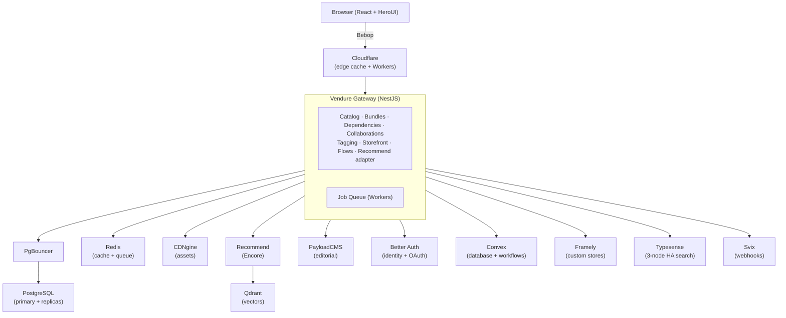

# Simket

A digital-goods marketplace where creators sell products (Unity packages,
images, templates, tools) and buyers discover them through editorial
curation and algorithmic recommendation.

---

## What is Simket?

Simket is a **creator-first digital marketplace** built on
[Vendure](https://vendure.io) (headless commerce). It combines:

- **A marketplace storefront** with editorial "Today" picks and an
  infinite-scroll discovery feed powered by pluggable recommendation
  algorithms.
- **Creator stores** either a generic product template or a fully
  custom page built with [Framely](https://github.com/belastrittmatter/Framely)
  (drag-and-drop page builder with HeroUI components).
- **Commerce primitives** bundles, product dependencies (with optional
  discounts), multi-creator collaborations (revenue splitting), and
  configurable checkout flows with upsells.
- **An asset pipeline** (CDNgine) that ingests creator uploads and
  transforms them into optimised delivery formats (WebP, animated WebP,
  streaming video).

---

## Service model

---

## System boundary

| Peer system        | Relationship                                                                                                         |
| ------------------ | -------------------------------------------------------------------------------------------------------------------- |
| **Cloudflare**     | Edge CDN and Workers. SWR caching reduces origin load 80%+. DDoS mitigation. Geo-routing.                            |
| **CDNgine**        | Stores and transforms all creator binary assets. Simket holds only asset IDs.                                        |
| **Better Auth**    | Owns user identity, OAuth, and authentication. Simket validates JWTs and caches profiles.                            |
| **PayloadCMS**     | Manages editorial content ("Today" section). Simket fetches articles via API.                                        |
| **Convex**         | Reactive database and durable scheduled functions collaboration settlement, scheduled re-indexing, complex checkout. |
| **Framely**        | Hosts custom creator store pages. Vendure provides product data; Framely renders the page.                           |
| **Stripe Connect** | Marketplace payment processing with connected accounts. Collaboration revenue splits via destination charges.        |
| **Typesense**      | Full-text search with native Raft-based HA clustering (3-node), C++ in-memory, sub-50ms latency.                     |
| **Svix**           | Webhook delivery infrastructure signing, retries, observability for all outbound events.                             |
| **Qdrant**         | Vector database for product embeddings and semantic "more like this" discovery.                                      |
| **Redis**          | Application cache (L2) and BullMQ job queue. Cluster mode. Separate cache vs queue clusters.                         |
| **PostgreSQL**     | Vendure's primary database. PgBouncer connection pooling, read replicas, Citus partitioning at scale.                |
| **Cedar**          | Fine-grained authorization policies (entitlements, collaborator perms, moderation).                                  |
| **CrowdSec**       | Community-fed abuse defence bot detection, IP reputation, automated blocking.                                        |
| **Keygen**         | License key management for creators selling software products.                                                       |
| **ClamAV**         | Malware scanning on all uploaded creator assets before publishing.                                                   |

---

## Core constraints

1. **Worker-first** Anything that an run off the request path _must_
   (media transforms, search indexing, settlement, email).
2. **Single source of truth** Each entity has one owning service. No
   cross-service writes.
3. **HeroUI everywhere** All UI uses HeroUI React components.
4. **TipTap for all rich text** With iFramely embed and Cavalry
   web-player support.
5. **Pluggable recommendations** Three interfaces (`CandidateSource`,
   `Ranker`, `PostProcessor`) with registry-based registration.
6. **CDNgine owns artefacts** No blobs in the Simket database.
7. **Better Auth owns identity** No password sorage in Simket.

---

## Key domain concepts

| Concept           | Description                                                                               |
| ----------------- | ----------------------------------------------------------------------------------------- |
| **Product**       | A sellable digital good with hero media, TipTap description, price, and terms of service. |
| **Bundle**        | Multiple products sold together at a discount.                                            |
| **Dependency**    | "Buy X before you can buy Y" with optional discount.                                      |
| **Collaboration** | Revenue split between product creators (% based).                                         |
| **Checkout Flow** | Configurable sequence of checkout steps (upsells, cross-sells, post-sale pages).          |
| **Store Page**    | Content page universal or product-specific, pre-sale or post-sale. Templatable.           |
| **Take Rate**     | Platform commission (≥ 5%). Higher take rate → more recommendation boost.                 |
| **Framely Store** | Optional custom store page built with drag-and-drop editor.                               |

---

## High-level flows

### Creator publishes a product

1. Creator fills product details (title, TipTap description, price, TOS).
2. Creator uploads hero media → CDNgine transforms to WebP + video.
3. Creator optionally invites collaborators (Convex invitation action).
4. Creator sets checkout flow (or uses default).
5. Creator publishes → product enters search index + recommendation pool.

### Buyer discovers and purchases

1. Buyer browses homepage: editorial "Today" section + recommendation feed.
2. Buyer opens product page (generic template or Framely store).
3. Buyer adds to cart → dependency check → bundle resolution.
4. Buyer goes through checkout flow → payment → access granted.
5. Convex action processes collaboration revenue settlement.

---

## Architecture decisions

| Decision                                   | Rationale                                                                                                                                                                                                               |
| ------------------------------------------ | ----------------------------------------------------------------------------------------------------------------------------------------------------------------------------------------------------------------------- |
| **Vendure as commerce core**               | TypeScript, NestJS, plugin system, Bebop API (adapted from internal resolvers), worker/job queue, proven e-commerce abstractions.                                                                                       |
| **Encore for recommend service**           | Infrastructure-from-code, auto-scaling, pub/sub ideal for ML-adjacent services that don't need Vendure's commerce primitives.                                                                                           |
| **Convex for database + workflows**        | Managed reactive database with built-in scheduled functions and durable actions. Replaces dedicated SQL database and workflow engine. Scoped to user state / workflows NOT the product catalog.                         |
| **PayloadCMS for editorial**               | TypeScript, self-hosted, REST APIs, purpose-built for CMS avoids conflating editorial and commerce concerns.                                                                                                            |
| **Framely for custom stores**              | Existing page builder with recursive element tree and JSON serialization. Adding HeroUI components extends it for our component system.                                                                                 |
| **Better Auth for identity**               | TypeScript-native OAuth provider with email/password, social login, 2FA, API keys, organisations replaces custom identity services.                                                                                     |
| **Typesense for search**                   | C++ in-memory search with native Raft-based HA clustering (3-node Raft consensus), sub-50ms p95 latency. Scales to millions of documents with built-in failover. Chosen over MeiliSearch which lacks OSS clustering/HA. |
| **Qdrant for vectors**                     | Dedicated vector database with binary quantisation (4-8× memory savings). Semantic "more like this" at p50 ~3ms, 1200+ RPS. Self-hosted cost: $40-100/mo for 10M vectors.                                               |
| **Cedar for authorization**                | AWS-backed fine-grained policy language with microsecond evaluation. Structured authz instead of scattered if-checks.                                                                                                   |
| **Stripe Connect for payments**            | Connected accounts + destination charges enable automatic collaboration revenue splits. Volume discounts at scale.                                                                                                      |
| **Svix for webhooks**                      | Purpose-built webhook infrastructure signing, retries, delivery observability avoids building custom retry queues.                                                                                                      |
| **Cloudflare Workers for edge caching**    | SWR caching at 300+ edge PoPs reduces origin load 80%+. Segment-based cache keys for personalisation. $0-20/mo for 10M requests.                                                                                        |
| **PostgreSQL + PgBouncer for Vendure SQL** | Transaction-mode connection pooling, read replicas for browse queries, Citus partitioning at >5M products. Proven at massive e-commerce scale.                                                                          |
| **Bebop for API serialisation**            | Zero-copy binary codec: ≤0.2ms serialisation (vs ~1.2ms JSON), ~4.5× smaller payloads. Critical for edge cache efficiency and mobile bandwidth.                                                                         |
| **Cockatiel for resilience**               | TypeScript-first circuit breaker + retry + timeout + bulkhead policies on every outbound call. Per-service granularity prevents cascade failures.                                                                       |
| **Fail-closed security**                   | Cedar (authz), ClamAV (scanning), CrowdSec (abuse) deny by default when unreachable. No silent bypass.                                                                                                                  |

---

## Service boundaries

| Boundary                   | In scope                                                                                                       | Out of scope                                                       |
| -------------------------- | -------------------------------------------------------------------------------------------------------------- | ------------------------------------------------------------------ |
| **Simket (Vendure)**       | Products, orders, payments, customers, bundles, dependencies, collaborations, flows, tags, search, store pages | Binary assets, user identity, editorial content, recommendation ML |
| **Cloudflare (edge)**      | Edge caching (SWR), DDoS mitigation, geo-routing, static assets                                                | Business logic, data persistence                                   |
| **PostgreSQL + PgBouncer** | Vendure product catalog, orders, inventory (via TypeORM)                                                       | User preferences, workflows (use Convex)                           |
| **Redis**                  | Application cache (L2), BullMQ job queues, rate limiting                                                       | Persistent data storage                                            |
| **CDNgine**                | Asset storage, transformation, delivery, ClamAV scanning, ExifTool metadata strip                              | Product metadata, pricing, access control logic                    |
| **Better Auth**            | Registration, login, OAuth, token issuance, 2FA, profile                                                       | Commerce data, product ownership                                   |
| **PayloadCMS**             | Editorial articles, curated collections                                                                        | Product data, user data                                            |
| **Recommend service**      | Candidate retrieval, ranking, post-processing, Qdrant vector search                                            | Product data (receives IDs only), payment                          |
| **Convex**                 | User preferences, recommendation state, workflow orchestration, real-time collaboration, notifications         | Product catalog, search indexes, asset metadata                    |
| **Framely**                | Page rendering, drag-and-drop editing                                                                          | Product data (fetches from Vendure API)                            |
| **Typesense**              | Full-text indexing, faceted filtering (3-node HA cluster)                                                      | Business logic, access control                                     |
| **Svix**                   | Webhook signing, delivery, retries                                                                             | Event generation (receives from Vendure)                           |
| **Cedar**                  | Policy evaluation (entitlements, perms)                                                                        | Data storage, business logic                                       |
| **Keygen**                 | License creation, validation, entitlements                                                                     | Product data, payments                                             |
| **Stripe Connect**         | Payment capture, payouts, connected accounts                                                                   | Product catalog, user identity                                     |

---

## Developer checklist

- [ ] Read [docs/architecture.md](docs/architecture.md)
- [ ] Read [docs/service-architecture.md](docs/service-architecture.md)
- [ ] Read [docs/domain-model.md](docs/domain-model.md)
- [ ] Familiarise with [Vendure plugin development](https://docs.vendure.io/current/core/developer-guide/plugins/)
- [ ] Familiarise with [HeroUI components](https://heroui.com)
- [ ] Set up local dev environment (see runbooks)
- [ ] Understand the [CDNgine](../cdngine/docs/README.md) and
      [Better Auth](https://www.better-auth.com/docs) boundaries

---

## Documentation index

| Document              | Path                                                                         |
| --------------------- | ---------------------------------------------------------------------------- |
| Architecture          | [`docs/architecture.md`](docs/architecture.md)                               |
| Service Architecture  | [`docs/service-architecture.md`](docs/service-architecture.md)               |
| Domain Model          | [`docs/domain-model.md`](docs/domain-model.md)                               |
| Docs landing          | [`docs/README.md`](docs/README.md)                                           |
| ADRs                  | [`docs/adr/`](docs/adr/)                                                     |
| Threat models         | [`docs/threat-models/`](docs/threat-models/)                                 |
| Runbooks              | [`docs/runbooks/`](docs/runbooks/)                                           |
| Programming practices | [`docs/regular-programming-practices/`](docs/regular-programming-practices/) |
