# Simket Architecture

> **Owner**: Platform team
> **Status**: Living document update on every boundary or contract change
> **Audience**: Anyone who writes, reviews, or deploys Simket code

---

## 1 Purpose

Simket is a **digital-goods marketplace** that lets creators sell products
(Unity packages, images, templates, tools) while giving buyers a discovery
experience powered by editorial curation and algorithmic recommendation.

The system must:

| Concern           | Guarantee                                                                                                                                         |
| ----------------- | ------------------------------------------------------------------------------------------------------------------------------------------------- |
| **Commerce**      | Accept payments, split revenue among collaborators, enforce product dependencies and bundles.                                                     |
| **Storefront**    | Render a marketplace homepage, per-product pages (generic template _or_ custom Framely stores), and post-sale pages.                              |
| **Discovery**     | Blend editorial picks ("Today" section) with a pluggable recommendation pipeline that can be swapped or extended without touching the storefront. |
| **Assets**        | Ingest creator uploads (images, video, Unity packages) and transform them through the CDNgine pipeline into optimised delivery formats.           |
| **Creator tools** | Provide a dashboard for managing products, collaborations, checkout flows, and analytics.                                                         |
| **Extensibility** | Every public capability is exposed as a versioned, programmatic API. Worker-first: anything that can run off the request path _must_.             |

---

## 2 Non-negotiable rules

1. **Worker-first** Heavy computation (media transcoding, search indexing,
   recommendation scoring, collaboration settlement) runs on worker processes
   via Vendure job queues or Convex scheduled functions. The request path
   returns immediately with a job handle.
2. **Single source of truth per record** Each domain entity has exactly one
   owning service (§7). No cross-service writes.
3. **Bebop contract surface** All client-facing data flows through Vendure's
   Bebop gateway (binary serialisation via `.bop` schemas). Internal
   service-to-service calls use typed RPC (Encore) or event bus.
4. **Pluggable recommenders** The recommendation pipeline defines three
   interfaces (`CandidateSource`, `Ranker`, `PostProcessor`). Implementations
   are registered, not hard-coded.
5. **CDNgine owns artefacts** Every binary artefact (images, packages, video)
   is stored and served by CDNgine. Simket stores only references (asset IDs +
   metadata).
6. **Better Auth owns identity** Authentication and identity live in
   Better Auth (TypeScript auth library deployed as the OAuth provider).
   Simket consumes verified tokens; it never stores passwords
   or issues its own tokens.
7. **HeroUI everywhere** All user-facing UI is built with HeroUI React
   components. No other component libraries.
8. **Rich text = TipTap** Every long-form text field (descriptions, post-sale
   pages, editorial articles) uses TipTap with iFramely embeds and Cavalry
   web-player support.
9. **Every outbound call through Cockatiel** All calls to peer services
   (Typesense, Qdrant, CDNgine, Hyperswitch, Keygen, Cedar, CrowdSec, Convex,
   PayloadCMS) go through a Cockatiel resilience policy (circuit breaker +
   timeout + retry where safe). No raw `fetch` / `axios` calls to
   external services.
10. **Fail-closed on security** If Cedar (authz), ClamAV (scanning), or
    CrowdSec (abuse) are unreachable, the operation is denied never
    silently permitted.
11. **Idempotent by default** Every state-changing webhook handler and
    queue consumer must be idempotent. Deduplication keys (event IDs,
    job IDs) are mandatory.
12. **Cache-aside, delete-on-write** On any mutation, delete the cache
    key (Redis + Cloudflare purge). Never overwrite cached values
    directly. The next read populates the cache. TTL is the safety net.
13. **Checkout reads skip cache** Cart validation and payment flows
    always read prices and availability from Vendure SQL directly.
    Stale cached prices must never reach the payment step.

---

## 3 Logical architecture

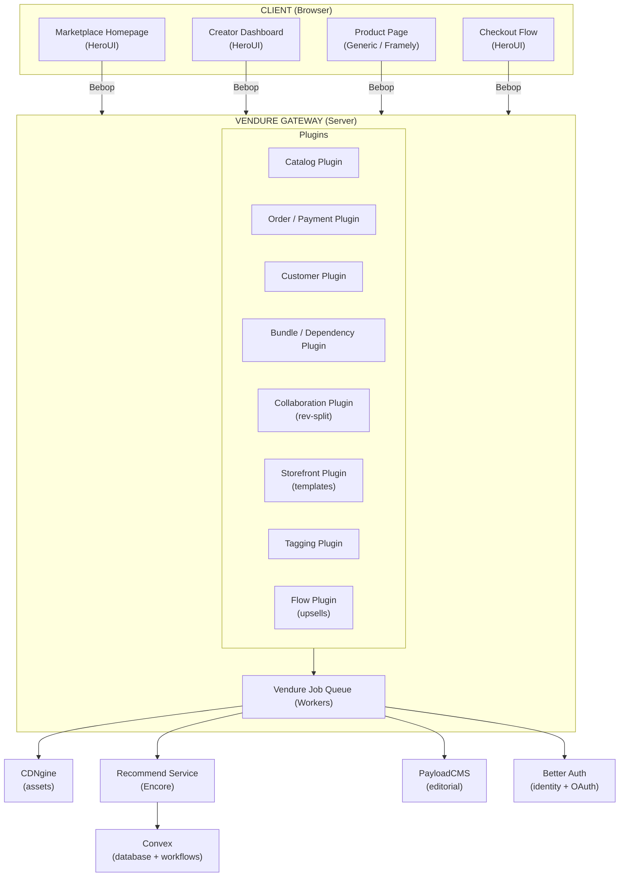

### 3.1 Layer responsibilities

| Layer                 | Runs                          | Owns                                                                                                                                           |
| --------------------- | ----------------------------- | ---------------------------------------------------------------------------------------------------------------------------------------------- |
| **Client apps**       | Browser (React + HeroUI)      | UI state, client-side routing, theme (dark/light).                                                                                             |
| **Vendure gateway**   | Node.js server process        | Bebop schema, request auth, plugin orchestration, short-lived business logic.                                                                  |
| **Vendure workers**   | Node.js worker process(es)    | Job queue processing search indexing, email dispatch, asset metadata sync, collaboration settlement.                                           |
| **Recommend service** | Encore service                | Candidate retrieval, ranking, post-processing. Exposes internal API consumed by Vendure gateway plugin.                                        |
| **PayloadCMS**        | Self-hosted Node.js           | Editorial articles, "Today" section content, collection/tag management for editorial.                                                          |
| **CDNgine**           | Separate deployment           | Binary artefact ingestion, transformation (image → webp, video → streaming), delivery via edge CDN.                                            |
| **Better Auth**       | Separate deployment           | User registration, login, OAuth provider, token issuance, identity federation, 2FA.                                                            |
| **Convex**            | Managed platform (convex.dev) | Reactive database, durable scheduled functions collaboration revenue settlement, complex checkout flows, scheduled recommendation re-indexing. |

---

## 4 System boundary

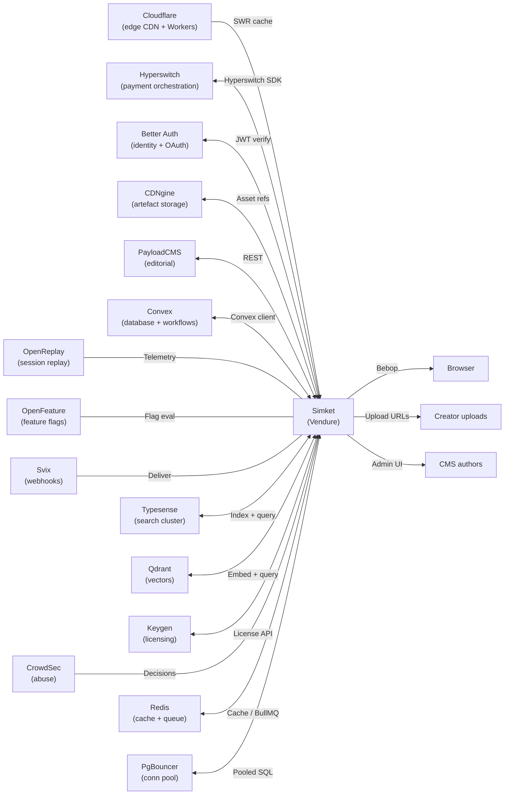

### 4.1 Inputs and outputs

| Direction | Peer                  | Protocol                     | Data                                                                            |
| --------- | --------------------- | ---------------------------- | ------------------------------------------------------------------------------- |
| **In**    | Browser               | Bebop over HTTPS             | Queries, mutations, subscriptions                                               |
| **In**    | Creator uploads       | Bebop mutation → CDNgine SDK | Binary artefacts (images, packages, video)                                      |
| **In**    | CMS authors           | PayloadCMS Admin UI          | Editorial articles, curated collections                                         |
| **In**    | Webhooks              | HTTPS POST                   | Payment confirmations (Hyperswitch), CDNgine transform-complete events, Keygen license events, Payload editorial publish/update/delete events |
| **Out**   | Hyperswitch           | HTTPS (Hyperswitch SDK)      | Payment creation, confirmation, capture, refunds, split payments, payouts, smart routing                                                     |
| **Out**   | CDNgine               | HTTPS (CDNgine API)          | Upload pre-signed URLs, transform requests, asset metadata                      |
| **Out**   | Better Auth           | HTTPS (token verify)         | JWT validation, user profile fetch, OAuth flows                                 |
| **Out**   | PayloadCMS            | REST                         | Article content, editorial collections                                          |
| **Out**   | Convex                | HTTPS (Convex client)        | Database reads/writes, scheduled function dispatch, action invocation           |
| **Out**   | Email (transactional) | SMTP / API                   | Order confirmations, collaboration invites                                      |
| **Out**   | Svix                  | HTTPS                        | Outbound webhook signing, delivery, retries                                     |
| **Out**   | Typesense             | HTTPS                        | Index updates, full-text + faceted search queries                               |
| **Out**   | Qdrant                | gRPC / HTTPS                 | Vector upserts, ANN similarity queries                                          |
| **Out**   | Keygen                | HTTPS                        | License creation, validation, entitlement checks                                |
| **Out**   | CrowdSec LAPI         | HTTPS                        | IP reputation checks, ban decisions                                             |

---

## 5 Service ownership

Each bounded context is implemented as a **Vendure plugin** unless it requires
its own runtime (noted below).

| Service                  | Owner           | Runtime         | Responsibility                                                                                                                             |
| ------------------------ | --------------- | --------------- | ------------------------------------------------------------------------------------------------------------------------------------------ |
| **Catalog plugin**       | Commerce team   | Vendure plugin  | Product CRUD, variants, pricing, custom fields (hero images, transparent overlays, TipTap descriptions).                                   |
| **Bundle plugin**        | Commerce team   | Vendure plugin  | Bundle definition, bundle pricing, bundle-to-product associations.                                                                         |
| **Dependency plugin**    | Commerce team   | Vendure plugin  | Purchase prerequisites ("buy X before Y"), optional dependency discounts.                                                                  |
| **Collaboration plugin** | Commerce team   | Vendure plugin  | Multi-creator revenue splits (% based), invitation flow, settlement via Convex action + Hyperswitch split payments.             |
| **Storefront plugin**    | Storefront team | Vendure plugin  | Generic product template, post-sale pages, universal vs product-scoped page config, saved page templates, system template gallery, and template duplication. |
| **Framely integration**  | Storefront team | Next.js app     | Custom creator stores, drag-and-drop page builder with HeroUI components, subdomain routing.                                               |
| **Tagging plugin**       | Discovery team  | Vendure plugin  | Product tags, creator tags, tag suggestions, tag enforcement rules.                                                                        |
| **Flow plugin**          | Commerce team   | Vendure plugin  | Checkout flow builder, upsell/cross-sell steps, flow templates.                                                                            |
| **Recommend service**    | Discovery team  | Encore service  | Pluggable recommendation pipeline (candidate sources → rankers → post-processors).                                                         |
| **Editorial service**    | Content team    | PayloadCMS      | "Today" section, editorial articles, curated collections, article scheduling.                                                              |
| **Asset pipeline**       | Platform team   | CDNgine         | Upload (via Uppy + @tus/server), ClamAV scan, ExifTool metadata strip, transform (→ webp, animated webp, streaming video), deliver, purge. |
| **Identity**             | Platform team   | Better Auth     | Registration, login, OAuth provider, token issuance, 2FA, profile management.                                                              |
| **Workflow engine**      | Platform team   | Convex          | Collaboration settlement, scheduled re-indexing, complex checkout orchestration.                                                           |
| **Search**               | Discovery team  | Typesense       | Full-text indexing, faceted filtering, typo tolerance, search ranking. Native Raft-based HA clustering.                                    |
| **Vector store**         | Discovery team  | Qdrant          | Embedding storage, ANN retrieval for semantic similarity and "more like this".                                                             |
| **Webhooks**             | Platform team   | Svix            | Outbound event signing, delivery, retry, and operational observability.                                                                    |
| **Authorization**        | Platform team   | Cedar           | Fine-grained policy evaluation for entitlements, collaborator perms, moderation.                                                           |
| **Licensing**            | Commerce team   | Keygen          | License key generation, validation, entitlements, and device activation for software products.                                             |
| **Payment orchestration** | Commerce team  | Hyperswitch     | Payment creation, capture, refunds, split payments (collaboration splits), payouts (creator disbursements), smart routing across processors, PCI-compliant vault. |
| **Abuse defence**        | Platform team   | CrowdSec        | Bot detection, IP reputation, community-fed threat intelligence.                                                                           |
| **API docs**             | Platform team   | Scalar          | Interactive API reference for all public Bebop/REST endpoints.                                                                             |
| **Feature flags**        | Platform team   | OpenFeature SDK | Progressive rollout, A/B tests, kill switches.                                                                                             |
| **Developer portal**     | Platform team   | Backstage       | Service catalog, API docs, internal tooling, onboarding.                                                                                   |
| **Session replay**       | Platform team   | OpenReplay      | Client-side session recording for debugging and UX analysis.                                                                               |

---

## 6 Lifecycle flows

### 6.1 Product creation

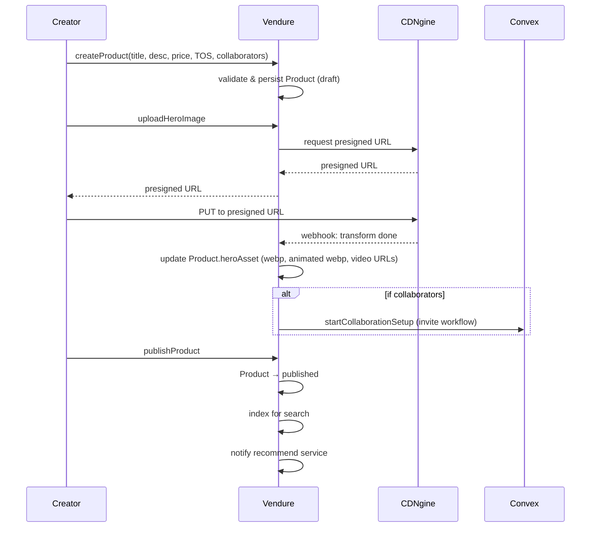

### 6.2 Purchase flow

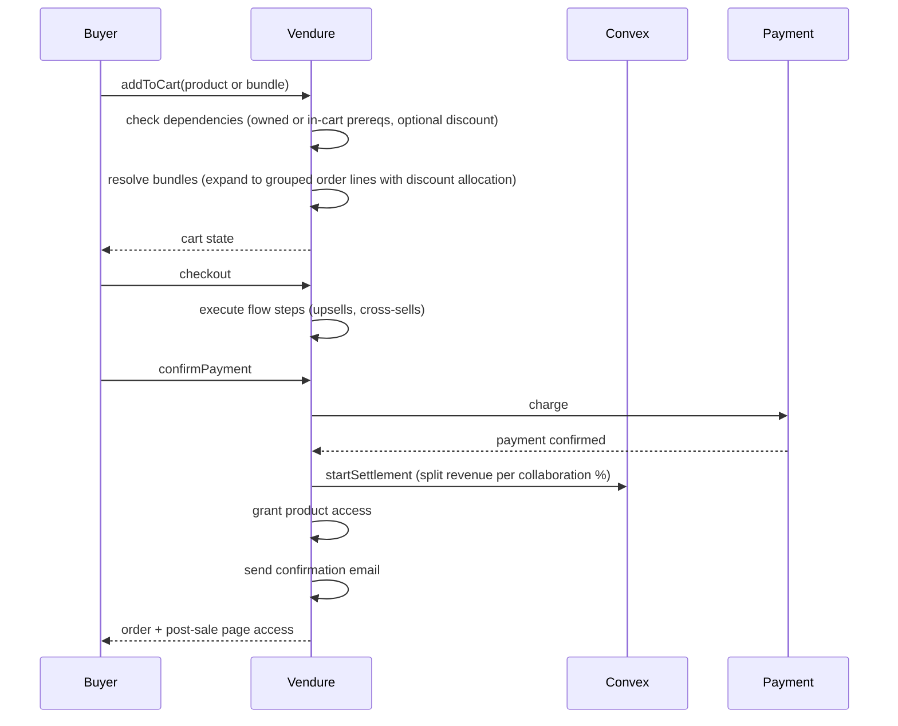

### 6.3 Recommendation pipeline

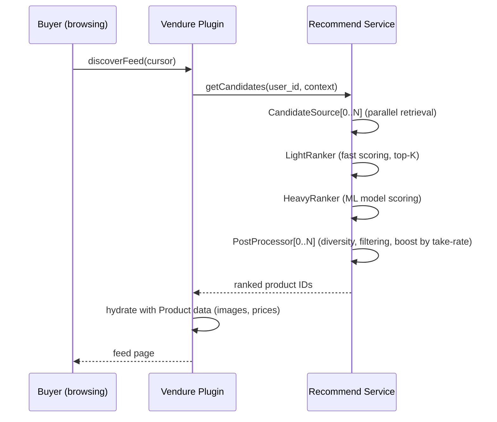

---

## 7 Truth and data ownership

| Record                                      | Source of truth                   | Consumed by                                              |
| ------------------------------------------- | --------------------------------- | -------------------------------------------------------- |
| **Product** (title, desc, price, TOS)       | Vendure DB                        | Storefront, Recommend service, PayloadCMS (linking)      |
| **ProductVariant**                          | Vendure DB                        | Storefront, Checkout                                     |
| **Bundle**                                  | Vendure DB (Bundle plugin)        | Checkout, Storefront                                     |
| **Dependency**                              | Vendure DB (Dependency plugin)    | Checkout (prereq check)                                  |
| **Collaboration**                           | Vendure DB (Collaboration plugin) | Convex (settlement), Creator Dashboard                   |
| **Order / Payment**                         | Vendure DB (order) + Hyperswitch (payment state) | Convex (settlement), Email, Analytics                    |
| **User identity**                           | Better Auth                       | Vendure (via JWT), all services                          |
| **User profile** (display name, avatar)     | Better Auth                       | Vendure Customer entity (cached)                         |
| **Binary artefact** (image, video, package) | CDNgine                           | Vendure (asset ID reference), Storefront (delivery URLs) |
| **Editorial article**                       | PayloadCMS DB                     | Storefront (Today section)                               |
| **Tag**                                     | Vendure DB (Tagging plugin)       | Search, Recommend service                                |
| **Recommendation model**                    | Recommend service (Encore)        | Storefront (via Vendure gateway)                         |
| **Recommendation embeddings**               | Qdrant                            | Recommend service (ANN queries)                          |
| **Feature flag state**                      | OpenFeature provider backend      | All services (via SDK)                                   |
| **Checkout flow definition**                | Vendure DB (Flow plugin)          | Checkout UI                                              |
| **Store page (Framely)**                    | Framely DB (Prisma)               | Storefront (custom store rendering)                      |
| **Session replay data**                     | OpenReplay                        | Internal analytics                                       |
| **Search index**                            | Typesense                         | Storefront (full-text queries)                           |
| **Webhook delivery state**                  | Svix                              | All outbound event consumers                             |
| **License keys / entitlements**             | Keygen                            | Checkout (creation), Storefront (validation)             |
| **Authorization policies**                  | Cedar (policy store)              | All services (policy evaluation)                         |
| **IP reputation / bans**                    | CrowdSec LAPI                     | Gateway (enforcement)                                    |

### 7.1 Ownership rule

> If a service does not own a record, it **must not** write to it directly.
> It reads via API or consumes events. The only exception is Vendure's
> `Customer` entity, which caches a subset of Better Auth profile fields
> for query performance this cache is refreshed on login and via a scheduled
> sync worker.

---

## 8 Request-path vs worker posture

Every operation is classified as **request-path** (must respond within
the HTTP timeout) or **worker** (can be deferred).

| Operation                    | Posture                  | Mechanism                                                            |
| ---------------------------- | ------------------------ | -------------------------------------------------------------------- |
| Product CRUD                 | Request-path             | Vendure resolver → DB                                                |
| Product search               | Request-path             | Typesense (pre-indexed, in-memory, typo-tolerant, faceted, sub-50ms) |
| Add to cart / checkout       | Request-path             | Vendure resolver → DB                                                |
| Payment charge               | Request-path             | Vendure → Hyperswitch SDK (synchronous, smart-routed)                    |
| Search index rebuild         | Worker                   | Vendure job queue                                                    |
| Media transformation         | Worker                   | CDNgine (async, webhook on complete)                                 |
| Recommendation scoring       | Request-path (cached)    | Recommend service (pre-computed, refreshed by worker)                |
| Recommendation model retrain | Worker                   | Convex scheduled function                                            |
| Collaboration settlement     | Worker                   | Convex action (durable)                                              |
| Email dispatch               | Worker                   | Vendure job queue                                                    |
| Editorial content sync       | Worker                   | Vendure job queue (polls PayloadCMS)                                 |
| Tag re-indexing              | Worker                   | Vendure job queue                                                    |
| Upload virus scan            | Worker                   | ClamAV (via CDNgine ingest pipeline)                                 |
| Upload metadata strip        | Worker                   | ExifTool (via CDNgine ingest pipeline)                               |
| License key creation         | Request-path             | Keygen API (on order completion)                                     |
| Webhook dispatch             | Worker                   | Svix (async delivery with retries)                                   |
| Authorization policy eval    | Request-path             | Cedar (in-process, microsecond latency)                              |
| IP reputation check          | Request-path             | CrowdSec bouncer (local cache)                                       |
| Feature flag evaluation      | Request-path             | OpenFeature SDK (in-memory cache)                                    |
| Session replay capture       | Request-path (async fir) | OpenReplay client SDK (fire-and-forget)                              |

---

## 9 Resilience & stability

This section defines how Simket prevents failures, contains their blast
radius, and recovers without human intervention. The goal is a system
where individual component failures never cascade into full outages.

### 9.1 Resilience primitives (Cockatiel)

All outbound calls from Vendure to peer services are wrapped in
[Cockatiel](https://github.com/connor4312/cockatiel) resilience policies.
Policies are centralised in a shared `ResilienceModule` and injected into
every plugin that makes external calls.

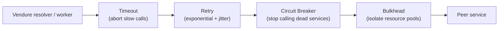

| Policy              | Configuration                                                                                        | Applies to                                                |
| ------------------- | ---------------------------------------------------------------------------------------------------- | --------------------------------------------------------- |
| **Timeout**         | 2s for seach/vector queries, 5s for payment calls, 10s for asset uploads                             | All outbound HTTPS/gRPC                                   |
| **Retry**           | 3 attempts, xponential backoff (200ms base), jitter ±50ms. Only idempotent operations.               | Typesense, Qdrant, CDNgine, Keygen, Cedar, Convex reads   |
| **Circuit breaker** | Open after 5 consecutive failures. Half-open after 10s. Reset on 2 successes.                        | All peer services (per-service granularity, never global) |
| **Bulkhead**        | 10 concurrent + 20 queued per service. Prevents one slow dependency from exhausting all connections. | Typesense, Qdrant, Recommend, CDNgine                     |

**Non-retryable operations** (mutations with side effects):

- Stripe payment captures idempotency key handles duplicates at Stripe's end.
- Order state transitions Vendure's state machine prevents invalid replays.
- Webhook deliveries Svix owns retry logic; Vendure fires once.

### 9.2 Failure scenarios

| Failure                    | Impact                                                         | Mitigation                                                                                                                                            |
| -------------------------- | -------------------------------------------------------------- | ----------------------------------------------------------------------------------------------------------------------------------------------------- |
| **Cloudflare edge down**   | Direct origin access, higher latency                           | DNS failover to secondary CDN or direct LB. Origin always reachable.                                                                                  |
| **Vendure server crash**   | Active requests fail                                           | Auto-restart (K8s liveness probe). Min 2 replicas. PodDisruptionBudget prevents simultaneous termination. Graceful shutdown drains in-fligt requests. |
| **Vendure worker crash**   | Background jobs stall                                          | BullMQ persists jobs in Redis. Stalled job detection re-queues after `stallInterval`. Dead letter queue for poison pills (>3 failures).               |
| **CDNgine unavailable**    | Uploads fail, existing assets still served from CDN edge cache | Circuit breaker on upload path. Retry with exponential backoff. Upload queue buffers until recovery.                                                  |
| **Better Auth down**       | New logins fail, existing sessions valid until token expiry    | JWT validation is local (public key cached with 24h TTL). Grace period on token refresh.                                                              |
| **Recommend service down** | Discovery feed degrades                                        | Fallback to "popular" / "recent" (no ML). Circuit breaker in Vendure plugin. Cached recommendations served stale.                                     |
| **PayloadCMS down**        | "Today" section stale                                          | Cache editorial content in Redis (L2) and edge (L1). TTL-based refresh. Stale content always served.                                                  |
| **Convex unavailable**     | Settlement and workflows stall                                 | Convex has built-in replication and automatic failover. Vendure core continues against its own SQL DB. Convex actions are durable resume on recovery. |
| **Stripe down**            | Purchases fail                                                 | Show user-friendly error. Idempotency keys prevent double charges on retry. Webhook reconciliation on recovery.                                       |
| **Vendure SQL DB down**    | Full outage for Vendure data                                   | Primary + 2 read replicas, PgBouncer, automated failover, point-in-time backups. Read traffic auto-routes to replica.                                 |
| **Redis down**             | Cache miss spike, job queue stall                              | Cluster mode with automatic failover. App degrades gracefully (bypasses cache, hits origin). BullMQ jobs survive Redis restart (AOF persistence).     |
| **Typesense down**         | Search degrades                                                | Raft cluster auto-fails over to healthy nodes. If full cluster loss: circuit breaker opens, fallback to Vendure SQL LIKE (degraded).                  |
| **Qdrant down**            | Semantic discovery unavailable                                 | Fallback to tag-based similarity. Circuit breaker prevents timeout pile-up. Vectors recoverable from source embeddings.                               |
| **Svix down**              | Webhooks delayed                                               | Svix has built-in retry/queue. Events buffered in Vendure until Svix accepts.                                                                         |
| **ClamAV down**            | Uploads quarantined                                            | Fail-closed: no asset published without scan. Retry on recovery. Backlog processes automatically.                                                     |
| **Keygen down**            | License checks fail                                            | Cache recent license checks (Redis, 1h TTL). Grace period for offline validation.                                                                     |
| **CrowdSec LAPI down**     | Abuse defence degrades                                         | Bouncer uses local cache of recent decisions. Fallback to basic rate limiting.                                                                        |
| **Cedar unreachable**      | Authz checks fail                                              | Fail-closed (deny). Policies cached locally with 5min TTL.                                                                                            |
| **PgBouncer crash**        | DB connections fail                                            | Sidecar auto-restart. Multiple PgBouncer instances. App retries with backoff.                                                                         |

### 9.3 Graceful shutdown

Every process handles `SIGTERM` properly for zero-downtime deploys:

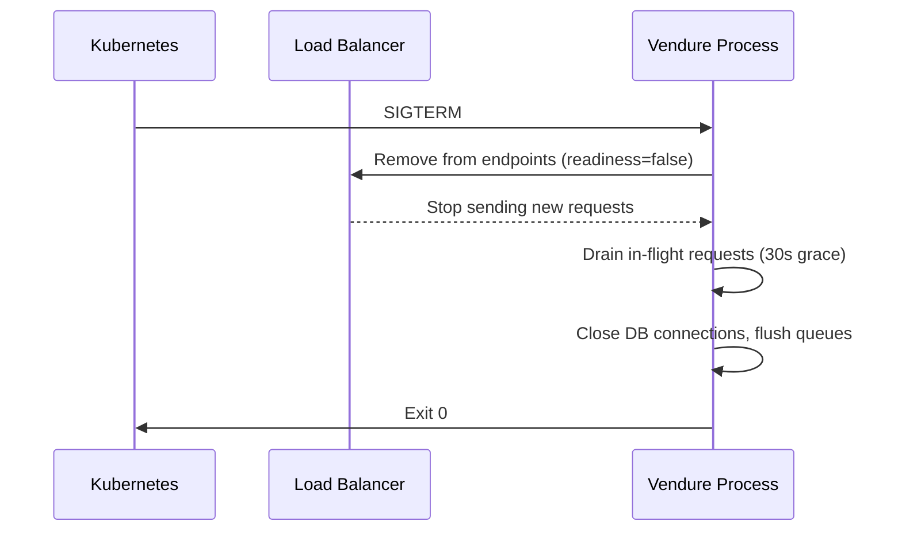

- **NestJS**: `app.enableShutdownHooks()` in bootstrap. Al services
  implement `OnModuleDestroy` for cleanup (close DB pools, flush buffers).
- **Workers**: BullMQ `worker.close()` waits for active jobs to complete.
  Jobs that exceed the grace period are returned to the queue (not lost).
- **Kubernetes**: `terminationGracePeriodSeconds: 60` (double the drain
  timeout to allow cleanup).
- **Rolling updates**: `maxUnavailable: 0`, `maxSurge: 1` new pod
  must be ready before old pod receives SIGTERM.

### 9.4 Health probes

| Endpoint          | Type      | Checks                                            | Failure action                                      |
| ----------------- | --------- | ------------------------------------------------- | --------------------------------------------------- |
| `/health/live`    | Livenss   | Process alive, event loop not blocked             | K8s restarts the pod                                |
| `/health/ready`   | Readiness | B connected, Redis reachable, Typesense reachable | K8s removes pod from service endpoints (no traffic) |
| `/health/startup` | Startup   | Migrtions complete, initial indexes loaded        | K8s waits before running liveness checks            |

Implemented via `@nestjs/terminus`:

- `TypeOrmHealthIndicator` Vendure SQL connectivity.
- `HttpHealthIndicator` Typesense, Qdrant, Svix reachability.
- Custom `RedisHealthIndicator` Redis ping.
- Custom `EventLoopHealthIndicator` event loop lag < 500ms.

**Worker health**: Workers expose the same `/health/live` endpoint.
Readiness check includes BullMQ connection state.

### 9.5 Idempotency & deduplication

| Operation                    | Idempotency mechanism                                                                                                   |
| ---------------------------- | ----------------------------------------------------------------------------------------------------------------------- |
| **Stripe payments**          | Stripe idempotency key (UUID generated at checkout start, stored in order metadata). Same key = same charge.            |
| **Webhook processing**       | `event.id` stored in Redis with 7-day TTL. Duplicate events are acknowledged but not reprocessed.                       |
| **Order state transitions**  | Vendure state machine: transition only succeeds if current state matches expected. Concurrent transitions are rejected. |
| **Search indexing**          | Typesense `upsert` is naturally idempotent. Same document ID overwrites.                                                |
| **Convex mutations**         | Convex transactions are serialisable conflicting mutations are automatically retried by the platform.                   |
| **Collaboration settlement** | Settlement action checks `settledAt` timestamp. Already-settled orders are skipped.                                     |
| **BullMQ jobs**              | Job ID derived from entity ID + event type. Duplicate job IDs are rejected by BullMQ.                                   |

### 9.6 Dead letter queues & poison pill handling

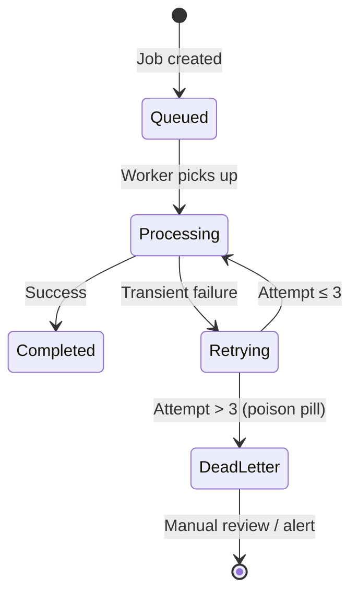

- Every BullMQ queue has a corresponding dead letter queue (DLQ).
- Jobs that fail 3 times are moved to DLQ with full error context.
- DLQ alerts trigger PagerDuty / Slack notification.
- DLQ dashboard in Backstage shows stuck jobs with replay button.
- **Poison pill detection**: if a job fails within <100ms consistently
  (indicating a code bug, not a transient issue), it is moved to DLQ
  after the first failure to avoid wasting retries.

### 9.7 Backpressure & rate limiting

| Layer           | Mechanism                                       | Configuration                                                         |
| --------------- | ----------------------------------------------- | --------------------------------------------------------------------- |
| **Cloudflare**  | DDoS mitigation, WAF rules, rate limiting by IP | 1000 req/min per IP (configurable per endpoint)                       |
| **CrowdSec**    | Bot detection, IP reputation bans               | Community blocklists + custom scenarios                               |
| **Vendure API** | NestJS `ThrottlerGuard`                         | 100 req/min per authenticated user, 30 req/min for anonymous          |
| **BullMQ**      | Queue max length + backoff                      | Max 10,000 pending jobs per queue. Producers get backpressure signal. |
| **Convex**      | Built-in rate limiting + bandwidth quotas       | Monitor and alert at 80% tier. Paginated queries mandatory.           |

When a service is overwhelmed, it returns `429 Too Many Requests` with
a `Retry-After` header. Clients must respect this. The edge layer
(Cloudflare Workers) can serve stale cached responses while the origin
recovers.

### 9.8 Deployment safety

| Practice                | Implementation                                                                                                                                                                                    |
| ----------------------- | ------------------------------------------------------------------------------------------------------------------------------------------------------------------------------------------------- |
| **Rolling updates**     | `maxUnavailable: 0`, `maxSurge: 1`. New pod ready before old pod drains.                                                                                                                          |
| **Canary releases**     | OpenFeature flag gates new code paths. Gradual rollout by percentage.                                                                                                                             |
| **PodDisruptionBudget** | `minAvailable: 1` for Vendure servers, workers, Typesense nodes. Prevents cluster-wide disruption during node maintenance.                                                                        |
| **Database migrations** | Forward-compatible only. Never drop columns in the same release that stops using them. Two-phase: 1) deploy code that handles both schemas, 2) migrate, 3) deploy code that only uses new schema. |
| **Feature flags**       | All new features behind OpenFeature flags. Kill switch for any feature without redeploy.                                                                                                          |
| **Rollback**            | Container image pinning. `kubectl rollout undo` returns to previous ReplicaSet. Database migrations are reversible.                                                                               |
| **Smoke tests**         | Post-deploy health check suite: product search, cart operations, auth flow. Auto-rollback if smoke tests fail.                                                                                    |

### 9.9 Data integrity invariants

| Invariant                                | Enforcement                                                                                    | Recovery                                                         |
| ---------------------------------------- | ---------------------------------------------------------------------------------------------- | ---------------------------------------------------------------- |
| **Order total = sum of line items**      | Computed in Vendure state machine transition. Assertion on every mutation.                     | Reconciliation job (daily) flags mismatches → DLQ.               |
| **Collaboration splits = 100%**          | Validated at product save time. Vendure custom field validator rejects invalid splits.         | N/A (prevented at write time).                                   |
| **No orphan assets**                     | Vendure `asset_reference` records + soft-delete grace period govern whether a CDNgine asset is still in use. Weekly reconciliation compares reference rows to CDNgine objects. | Manual review via CDNgine dashboard before purge.                |
| **License entitlement matches order**    | Keygen license created only on order completion webhook. Idempotent replay if webhook retried. | Reconciliation: compare Vendure orders ↔ Keygen licenses.        |
| **Search index consistent with catalog** | Evet-driven indexing on product CRUD. Daily full reindex as safety net.                        | Full reindex from Vendure DB (takes minutes, not hours).         |
| **Vector embeddings match catalog**      | Triggered on product CRUD alongside search index. Daily full re-embed.                         | Full re-embed from product descriptions.                         |
| **Webhook delivery**                     | Svix guarantees at-least-once delivery. Consumer idempotency handles duplicates.               | Svix dashboard shows failed deliveries. Manual replay available. |

### 9.10 Observability for stability

Stability is not just about preventing failures it's about detecting
them before users do.

| Signal                       | Tool                               | Alert threshold                                                          |
| ---------------------------- | ---------------------------------- | ------------------------------------------------------------------------ |
| **Error rate**               | OpenReplay + Encore metrics        | > 1% of requests returning 5xx → PagerDuty                               |
| **Latency (p95)**            | Encore distributed tracing         | > 500ms for any endpoint → warning. > 2s → critical.                     |
| **Circuit breaker state**    | Cockatiel metrics → Prometheus     | Any breaker OPEN → immediate alert.                                      |
| **BullMQ queue depth**       | Redis metrics                      | > 1000 pending jobs in any queue → warning. > 5000 → critical.           |
| **DLQ depth**                | Redis metrics                      | > 0 jobs in any DLQ → alert (every DLQ entry is actionable).             |
| **Event loop lag**           | `perf_hooks` monitorEventLoopDelay | > 200ms → warning. > 500ms → liveness probe fails, pod restarts.         |
| **Redis memory**             | Redis INFO                         | > 80% maxmemory → warning (cache eviction accelerating).                 |
| **PostgreSQL connections**   | PgBouncer stats                    | Active connections > 80% of pool → warning.                              |
| **Typesense cluster health** | Typesense `/health` API            | Any node unreachable → warning. Majority unreachable → critical.         |
| **Convex bandwidth**         | Convex dashboard metrics           | > 80% of tier limit → warning. Investigate query patterns.               |
| **Disk space**               | Node exporter                      | > 85% on any volume → critical (affects Typesense snapshots, Redis AOF). |
| **Sync drift**               | Reconciliation workers (see §9.11) | Any count mismatch between source ↔ derived > 0 → alert                  |

### 9.11 Synchronisation & consistency

Simket is a distributed system with 15+ services. Data will drift out of
sync the question is not "if" but "how fast we detect and heal it."
This section covers every synchronisation boundaryand how the system
stays consistent.

#### 9.11.1 Change propagation model

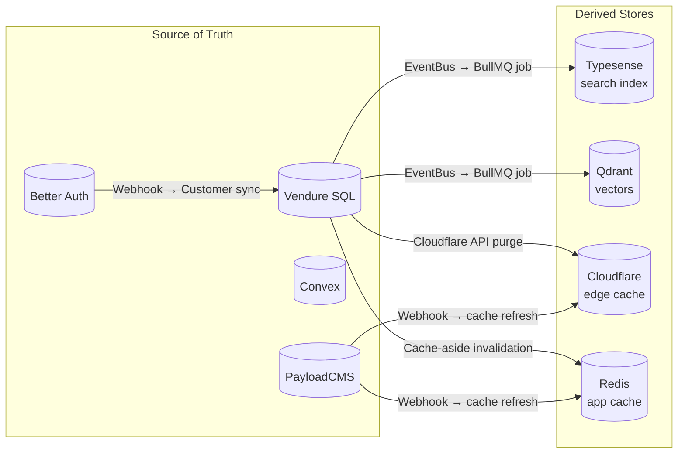

**Rule**: Every derived store has a known source of truth (§7) and a
defined maximum staleness window.

| Derived store             | Source of truth                    | Sync mechanism                                           | Expected lag                          | Recovery                                                          |
| ------------------------- | ---------------------------------- | -------------------------------------------------------- | ------------------------------------- | ----------------------------------------------------------------- |
| **Typesense index**       | Vendure SQL                        | EventBus → `SearchIndexJobQueue`                         | < 5s                                  | Full reindex from Vendure DB (minutes)                            |
| **Qdrant embeddings**     | Vendure SQL (product descriptions) | EventBus → `EmbeddingJobQueue`                           | < 30s                                 | Full re-embed from product text (minutes-hours)                   |
| **Cloudflare edge cache** | Vendure SQL                        | Targeted purge by URL/tag on product mutation            | < 10s (purge propagation)             | SWR serves stale while revalidating. Manual full purge available. |
| **Redis app cache**       | Vendure SQL / PayloadCMS           | Cache-aside: invalidate on write, TTL fallback (5-15min) | < 1s (invalidation) or ≤ TTL (expiry) | `FLUSHDB` on the cache cluster (not queue cluster)                |
| **Vendure Customer**      | Better Auth                        | Webhook on profile change + daily scheduled sync         | < 5s (webhook) / < 24h (fallback)     | Full sync worker: iterate all Better Auth users                   |
| **Editorial content**     | PayloadCMS                         | Webhook → Redis/edge invalidation + TTL                  | < 30s (webhook) / ≤ 5min (TTL)        | Warm cache from PayloadCMS API                                    |
| **Convex user state**     | Convex (own source)                | Reactive queries (real-time WebSocket push)              | < 100ms                               | N/A Convex is strongly consistent for its own data                |

#### 9.11.2 Self-healing reconciliation

Every derived store has a scheduled reconciliation worker that detects
and repairs drift independently of the real-time sync pipeline.

| Reconciliation job     | Schedule             | Method                                                                                                     | Action on mismatch                                                                                          |
| ---------------------- | -------------------- | ---------------------------------------------------------------------------------------------------------- | ----------------------------------------------------------------------------------------------------------- |
| **Search index**       | Daily 03:00 UTC      | Compare `COUNT(*)` Vendure products vs Typesense documents. Sample 100 random IDs and compare `updatedAt`. | Full reindex if count differs >1%. Selective update for stale samples.                                      |
| **Vector embeddings**  | Daily 04:00 UTC      | Compare Qdrant point count vs Vendure product count. Sample embedding checksums.                           | Re-embed missing/stale products.                                                                            |
| **Customer sync**      | Daily 06:00 UTC      | Compare Better Auth user count vs Vendure Customer count. Check `lastLoginAt` for recently active users.   | Create missing Customers. Update stale profiles.                                                            |
| **License integrity**  | Daily 05:00 UTC      | Compare Vendure completed orders with software products vs Keygen active licenses.                         | Create missing licenses. Flag orphan licenses for review.                                                   |
| **CDNgine references** | Weekly Sun 02:00 UTC | Compare Vendure `asset_reference.assetId` values (including recent soft-deletes still inside the grace period) vs CDNgine stored objects. | Flag orphan assets outside the grace period for manual review before purge. |

**Reconciliation rules**:

- Reconciliation workers are **read-heavy, write-cautious** they log
  mismatches and auto-fix only safe operations (upserts). Destructive
  fixes (deletes) require manual approval.
- Every reconciliation run emits a metric: `reconciliation_drift_count{store}`.
  Alert if any value > 0.
- Reconciliation is the **safety net**, not the primary sync path. If
  drift is consistently detected, fix the real-time pipeline.

#### 9.11.3 Real-time client consistency

When a creator updates a product and buyers have the store page open,
or when we deploy new code while users have dashboards open:

**A. Product updates reaching open pages**

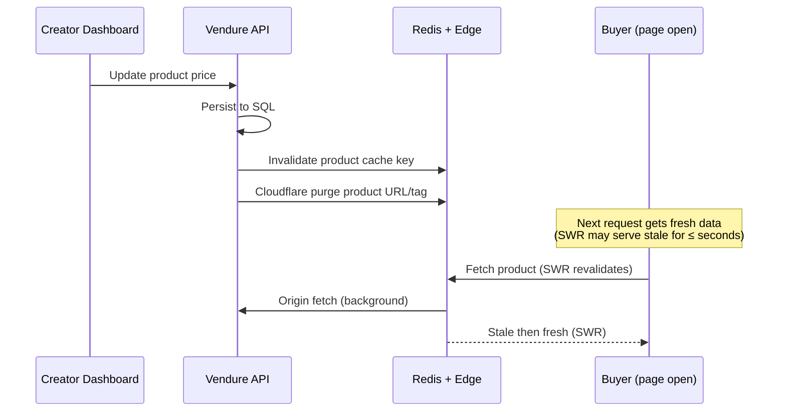

- **Storefront pages** use Stale-While-Revalidate (SWR). Users see the
  old price for at most a few seconds, then get the fresh version on
  the next navigation or background revalidation.
- **Cart & checkout**: Cart items are **always** validated against
  current Vendure prices at checkout time. If a price changed between
  cart add and checkout, the user sees the updated price with a notice:
  _"Price updated since you added this item."_
- **Critical fields** (price, availability, dependency requirements)
  bypass the SWR cache entirely checkout reads directly from Vendure
  SQL to guarantee consistency.

**B. Creator Dashboard real-time updates**

The Creator Dashboard uses **Convex reactive queries** for:

- Collaboration invitations and status changes
- Settlement/payout progress
- Notification counts
- Workflow execution status

Convex provides **linearisable consistency** with automatic WebSocket
push. Creators see changes within ~100ms without polling.

For Vendure-owned data displayed in the dashboard (product stats, order
counts), the dashboard uses a polling strategy:

- **Active tab**: Poll every 10 seconds.
- **Background tab**: Poll every 60 seconds (via `document.visibilityState`).
- **Manual refresh**: Always available.
- **Optimistic updates**: When a creator edits a product, the UI updates
  immediately (optimistic). If the server rejects, the UI reverts with
  an error toast.

**C. Deploy version mismatch**

When we deploy a new Vendure API or storefront version while users have
the old version open:

| Layer                          | Mechanism                                                                                                                                                                                                                              |
| ------------------------------ | -------------------------------------------------------------------------------------------------------------------------------------------------------------------------------------------------------------------------------------- |
| **API backward compatibility** | Non-breaking changes only. New fields are additive. Removed fields go through a deprecation cycle (serve both for 1 release). Bebop schemas are versioned old clients can still deserialise new messages (unknown fields are ignored). |
| **Client version detection**   | API responses include `X-API-Version` header. Client compares against its build-time version. On mismatch: show a non-blocking banner _"A new version is available reload for the latest features."_                                   |
| **Forced reload**              | If the API detects a client version older than `minSupportedVersion` (config), it returns `426 Upgrade Required`. The client shows a modal requiring reload. Used only for breaking changes.                                           |
| **Service Worker**             | The storefront Service Worker checks for new builds every 5 minutes. On new build detection: notify user, pre-cache new assets, reload on next navigation.                                                                             |
| **Feature flags**              | New features are behind OpenFeature flags. Even if old clients hit new API code, unknown feature flag evaluations return the default (safe) value.                                                                                     |

**D. Concurrent editing conflicts**

When two creators edit the same product simultaneously:

- **Vendure uses optimistic locking** (version column on entities).
  The second save receives a `409 Conflict` with the message
  _"This product was modified by another user. Please reload and try again."_
- **Framely pages** (Framely-based custom store pages) use
  **Hocuspocus** (Yjs CRDT) for real-time collaborative editing
  conflicts are automatically merged at the character level.
- **TipTap descriptions**: If Hocuspocus is enabled, real-time
  collaboration. If not, same optimistic locking as Vendure entities.

**E. Split-brain and network partition**

| Scenario                     | Behaviour                                                                                                                                                                                                      |
| ---------------------------- | -------------------------------------------------------------------------------------------------------------------------------------------------------------------------------------------------------------- |
| **Client loses network**     | Convex subscriptions reconnect automatically. Vendure API calls fail with timeout → circuit breaker → cached/stale data served. Cart operations queued locally (via Service Worker) and replayed on reconnect. |
| **Typesense node partition** | Raft consensus: minority partition becomes read-only, majority continues serving writes. On heal: minority catches up from write-ahead log.                                                                    |
| **Redis cluster partition**  | Redis Cluster: minority partition goes read-only. Clients route to majority. On heal: data merges. Separate cache vs queue clusters limit blast radius.                                                        |
| **Convex partition**         | Managed platform handles partitions internally. Client sees brief connection drop, auto-reconnects with full state sync.                                                                                       |

#### 9.11.4 Cache coherence protocol

All cache invalidation follows a strict protocol to prevent stale data
from persisting:

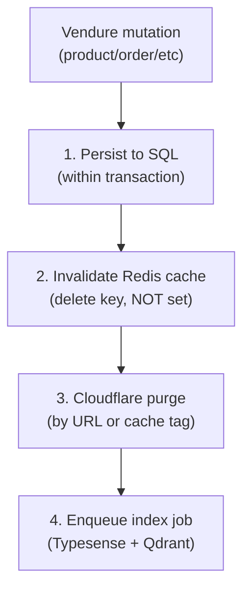

**Rules**:

1. **Delete, never overwrite** On mutation, delete the cache key.
   The next read populates it (cache-aside). This prevents race
   conditions where an outdated write overwrites a newer one.
2. **Purge by cache tag** Products are tagged in Cloudflare with
   `product:{id}`. Purging the tag invalidates all URLs containing
   that product (detail page, listing pages, API responses).
3. **TTL as safety net** Every cached value has a max TTL (5-15min
   for product data, 1h for editorial). Even if invalidation fails,
   staleness is bounded.
4. **Jittered TTLs** TTLs are randomised ±10% to prevent cache
   stampedes (§15).
5. **Write-through for checkout** Cart and checkout never read from
   cache. They always hit Vendure SQL directly to guarantee price
   and availability accuracy.

---

## 10 Scurity posture

### 10.1 Authentication

- All user-facing APIs require a valid JWT from **Better Auth**.
- Vendure's auth guard validates the JWT on every request and populates
  the `RequestContext` with the verified user identity.
- Admin API access requires role-based permissions managed within Vendure's
  role/permission system.
- Creator dashboard APIs enforce ownership checks a creator can only
  modify their own products, collaborations, and flows.

### 10.2 Authorization model

| Actor         | Scope                                           | Mechanism                               |
| ------------- | ----------------------------------------------- | --------------------------------------- |
| **Anonymous** | Browse products, view editorial, search         | No token required for public queries    |
| **Buyer**     | Purchase, view library, manage cart             | Valid JWT with `customer` role          |
| **Creator**   | CRUD own products, manage collaborations, flows | Valid JWT + Vendure channel permissions |
| **Admin**     | All operations, editorial management            | Valid JWT + Vendure `SuperAdmin` role   |

Fine-grained authorization uses **Cedar** policies evaluated at the edge:

- Entitlements (has user X purchased product Y?)
- Collaborator permissions (can user X edit product Y?)
- Moderation holds, payout locks, and content flags
- Cedar policies are version-controlled alongside service code

### 10.3 Data protection

- **Payments**: Simket never stores raw card data. Stripe Connect handles PCI
  compliance. Vendure stores only Stripe customer/payment-method IDs.
- **Uploads**: Pre-signed URLs for direct-to-CDNgine uploads via **Uppy** +
  **@tus/server** (resumable). Files never transit through the Vendure server.
  All uploads are scanned by **ClamAV** before publishing.
  **ExifTool** strips PII metadata from images on ingest.
- **PII**: Customer email and profile data in Vendure DB. Access logged.
  GDPR delete flows via Convex action.
- **Creator assets**: Access-controlled via CDNgine signed URLs. Only
  buyers with valid entitlements (verified via Cedar policy) receive download
  URLs. Software products optionally use **Keygen** license validation.
- **Rate limiting**: Bebop message size analysis + per-IP rate limiting
  on the gateway.
- **Abuse defence**: **CrowdSec** provides community-fed IP reputation,
  bot detection, and automated blocking at the edge.

### 10.4 Webhooks

All outbound events (payment confirmations, CDNgine processing results,
Keygen license activations) are delivered via **Svix**. Svix handles
cryptographic signing, automatic retries with exponential back-off,
and delivery observability.

### 10.4 Secrets management

- All secrets (Stripe keys, CDNgine API keys, Better Auth signing keys, DB
  credentials) stored in environment variables, never in source code.
- Production secrets managed via a secrets manager (e.g., AWS Secrets
  Manager, Vault).
- OpenFeature provider credentials follow the same pattern.

---

## 11 Deployment topology

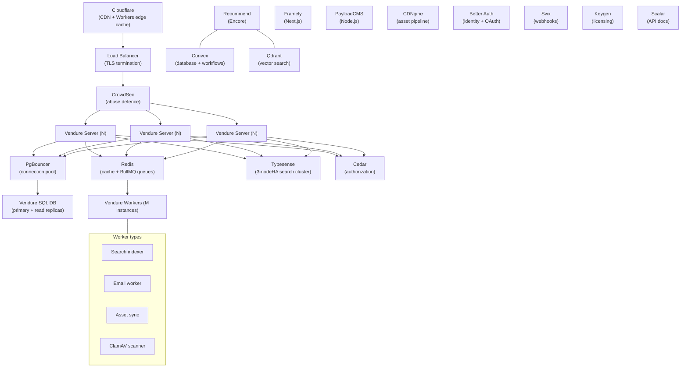

### 11.1 Scaling levers

| Component         | Scaling strategy                                                              |
| ----------------- | ----------------------------------------------------------------------------- |
| Cloudflare (edge) | Global PoPs, Workers auto-scale. SWR caching reduces origin load 80%+.        |
| Vendure server    | Horizontal (stateless, behind LB). HPA on CPU 60% + queue depth.              |
| Vendure worker    | Horizontal (dedicated queues per worker type). Scale on queue depth.          |
| PgBouncer         | Sidecar on app nodes. Transaction pooling mode.                               |
| Vendure SQL       | Read replicas (2+). Citus partitioning at >5M products.                       |
| Convex            | Managed platform auto-scales. Enterprise tier for high bandwidth.             |
| Recommend service | Horizontal (Encore auto-scales on request rate)                               |
| Framely           | Horizontal (stateless Next.js). Scale on concurrent connections.              |
| PayloadCMS        | Single instance (low write volume)                                            |
| CDNgine           | Independently scaled (see cdngine docs)                                       |
| Redis             | Cluster mode. Separate cache cluster (eviction) from queue cluster (durable). |
| Typesense         | 3-node Raft HA cluster, in-memory indexes. Add nodes for read throughput.     |
| Qdrant            | Horizontal (sharded collections). Binary quantisation for memory reduction.   |
| CrowdSec          | Sidecar + shared bouncer decisions                                            |
| Svix              | Managed SaaS or self-hosted (horizontally scalable)                           |
| Keygen            | Managed SaaS or self-hosted                                                   |

---

## 12 Technology stack

| Layer                          | Technology                                                                      | Role                                                                                                                                                      |
| ------------------------------ | ------------------------------------------------------------------------------- | --------------------------------------------------------------------------------------------------------------------------------------------------------- |
| **Commerce core**              | [Vendure](https://vendure.io) (TypeScript, NestJS)                              | Products, orders, payments, customers, plugin system, Bebop API, worker/job queue                                                                         |
| **API serialisation**          | [Bebop](https://bebop.sh)                                                       | Binary schema language replacing GraphQL on the wire. `.bop` schemas generate TypeScript codecs. Vendure resolvers are adapted via a translation layer.   |
| **Client framework**           | React 18+                                                                       | SPA rendering                                                                                                                                             |
| **Component library**          | [HeroUI](https://heroui.com) (Tailwind CSS)                                     | All UI components, dark/light theming                                                                                                                     |
| **Page builder**               | [Framely](https://github.com/belastrittmatter/Framely) (Next.js 15)             | Custom creator store pages, drag-and-drop editor                                                                                                          |
| **Rich text**                  | [TipTap](https://tiptap.dev) (ProseMirror)                                      | All long-form text editing (descriptions, post-sale pages, editorial)                                                                                     |
| **Embeds**                     | [iFramely](https://iframely.com)                                                | URL unfurling and rich embeds in TipTap content                                                                                                           |
| **Animation player**           | [Cavalry Web Player](https://cavalry.studio/docs/web-player/)                   | `<cavalry-player>` custom element for interactive animations                                                                                              |
| **Editorial CMS**              | [PayloadCMS](https://payloadcms.com) (TypeScript)                               | "Today" section, editorial articles, curated collections                                                                                                  |
| **Asset pipeline**             | CDNgine (internal)                                                              | Upload, transform (→ webp, animated webp, video), deliver via edge CDN                                                                                    |
| **Identity**                   | [Better Auth](https://github.com/better-auth/better-auth) (TypeScript)          | Registration, login, OAuth provider, JWT issuance, 2FA, session management, profile                                                                       |
| **Recommendation**             | Custom service (Encore)                                                         | Pluggable pipeline: candidate sources, rankers, post-processors                                                                                           |
| **Vector search**              | [Qdrant](https://qdrant.tech)                                                   | Embedding storage and ANN retrieval for "more like this" and semantic discovery                                                                           |
| **Backend framwork**           | [Encore](https://encore.dev) (TypeScript)                                       | Non-commerce microservices (recommend, analytics)                                                                                                         |
| **Workflow engine / Database** | [Convex](https://convex.dev)                                                    | Reactive document database, durable scheduled functions, real-time subscriptions replaces both dedicated workflow engine and primary application database |
| **Payments**                   | [tripe Connect](https://stripe.com/connect)                                     | Connected accounts, destination charges, marketplace payouts, collaboration splits                                                                        |
| **Webhooks**                   | [Svix](https://www.svix.com)                                                    | Webhook signing, delivery, retries, and operational monitoring for all outbound events                                                                    |
| **Search**                     | [Tyesense](https://typesense.org) (C++, in-memory)                              | Typo-tolerant full-text search with faceted filtering, native Raft-based HA clustering, sub-50ms latency                                                  |
| **Upload client**              | [Uppy](https://uppy.io) + [@tus/server](https://github.com/tus/tus-node-server) | Resumable file uploads for large creator assets (Unity packages, video)                                                                                   |
| **Malware scanning**           | [ClamAV](https://www.clamav.net)                                                | Antivirus scanning on all uploaded packages before publishing                                                                                             |
| **Metadata extracton**         | [ExifTool](https://exiftool.org)                                                | Metadata extraction, normalisation, and PII stripping on creator uploads                                                                                  |
| **Authorization policy**       | [Cedar](https://www.cedarpolicy.com)                                            | Fine-grained policy engine for entitlements, collaborator permissions, moderation rules                                                                   |
| **Abuse defence**              | [CrowdSec](https://www.crowdsec.net)                                            | Community-fed threat intelligence, bot detection, IP reputation for marketplace protection                                                                |
| **Licensing**                  | [Keygen](https://keygen.sh)                                                     | License key validation, entitlements, and device activation for creators selling software                                                                 |
| **API docs**                   | [Scalar](https://scalar.com)                                                    | Interactive API documentation UI for all public Bebop/REST endpoints                                                                                      |
| **Collaborative editing**      | [Hocuspocus](https://tiptap.dev/hocuspocus) (Yjs)                               | Real-time collaborative TipTap editing for editorial staff (optional)                                                                                     |
| **Feature flags**              | [OpenFeature](https://openfeature.dev)                                          | Vendor-neutral feature flag evaluation                                                                                                                    |
| **Developer portal**           | [Backstage](https://backstage.io)                                               | Service catalog, API docs, internal tooling                                                                                                               |
| **Session replay**             | [OpenReplay](https://openreplay.com)                                            | Client-side session recording, debugging                                                                                                                  |
| **Resilience**                 | [Cockatiel](https://github.com/connor4312/cockatiel) (TypeScript)               | Circuit breaker, retry, timeout, bulkhead policies for all outbound service calls                                                                         |
| **Health checks**              | [@nestjs/terminus](https://docs.nestjs.com/recipes/terminus)                    | Liveness, readiness, startup probes for Kubernetes                                                                                                        |
| **Vendure SQL DB**             | PostgreSQL (primary + read replicas)                                            | Vendure's own TypeORM-managed storage (not directly accessed by other services)                                                                           |
| **Connection pooling**         | [PgBouncer](https://www.pgbouncer.org)                                          | Transaction-mode connection pooling for Vendure SQL. Sidecar on app nodes.                                                                                |
| **Cache / Queue**              | Redis (cluster mode)                                                            | Application cache (L2), BullMQ job queue, recommendation cache. Separate clusters for cache (eviction) vs queue (durable).                                |
| **Edge / CDN**                 | [Cloudflare](https://www.cloudflare.com) (Workers + CDN)                        | Edge caching (SWR), DDoS mitigation, geo-routing, static asset delivery                                                                                   |

---

## 13 Performance & scalability

This section defines the caching layers, database scaling strategies,
performance budgets, and cost guardrails required to serve millions of
products and handle millions of daily requests at low operational cost.

### 13.1 Caching layers

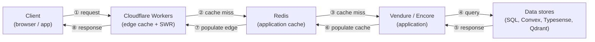

| Layer              | Technology                       | TTL strategy                                                                                                                                        | Cache key                                                                          |
| ------------------ | -------------------------------- | --------------------------------------------------------------------------------------------------------------------------------------------------- | ---------------------------------------------------------------------------------- |
| **L1 Edge**        | Cloudflare Workers               | `stale-while-revalidate`: serve stale immediately, revalidate in background. Short TTL (30-60s) for product pages, long TTL (24h) for static assets | URL + `Accept` header + user segment (anon / logged-in / creator). Never per-user. |
| **L2 Application** | Redis (same cluster as BullMQ)   | 5-15 min TTL for product listings, 1h for category trees, 30s for cart/session.                                                                     | `simket:{entity}:{id}:{version}` version incremented on mutation.                  |
| **L3 In-process**  | Node.js LRU (tiny, per-instance) | 10-30s. Config, feature flags, hot product metadata.                                                                                                | Function-scoped memoization.                                                       |

**Cache invalidation strategy:**

- Vendure entity events (`ProductEvent`, `CollectionEvent`) trigger:
  1. Redis key deletion for affected entity.
  2. Cloudflare Cache API purge for product/collection URLs.
  3. Typesense re-index for changed documents.
- Convex reactive subscriptions auto-invalidate downstream caches.
- Editorial (PayloadCMS) changes trigger CDN purge via webhook.

**Personalisation at the edge:**

- Core page shell (HTML, product grid, navigation) is cached per segment, not per user.
- Personal data (cart badge count, wishlist, notifications) hydrated client-side via lightweight Bebop API call.
- Recommendation feed is a sparate API call, not part of the cached page shell.

### 13.2 Database scaling

| Data store                   | Scaling strategy                                                                                                                                                                                                                                                            | Target capacity                                               |
| ---------------------------- | --------------------------------------------------------------------------------------------------------------------------------------------------------------------------------------------------------------------------------------------------------------------------- | ------------------------------------------------------------- |
| **Vendure SQL (PostgreSQL)** | PgBouncer connection pooling (transaction mode) → read replicas (2+) for browse/search queries → Citus partitioning by `channelId` or `productId` range at >5M products.                                                                                                      | 10M+ products, 50K concurrent connections via pooler.           |
| **Convex**                   | Managed auto-scaling. Mitigations for bandwidth limits: paginated queries everywhere, selective subscriptions (never subscribe to full collections), batch mutations, indexed reads only.                                                                                     | 1M+ active users. Enterprise tier for >25M function calls/mo. |
| **Typesense**                | 3-node Raft HA cluster. All data in RAM. Add nodes for read throughput. Enterprise sharding for >10M documents.                                                                                                                                                               | 5M+ products, sub-50ms p95 search latency.                    |
| **Qdrant**                   | Horizontal sharding + binary quantization (4-8× memory reduction). Self-hosted on commodity VMs.                                                                                                                                                                            | 10M+ vectors, p50 ~3ms, p95 ~8ms, 1200+ RPS.                  |
| **Redis**                    | Cluster mode for >64GB. Separate clusters for cache vs job queue to isolate eviction from durability.                                                                                                                                                                        | 100K+ keys, sub-1ms reads.                                    |

**Vendure SQL schema rules:**

- Cursor-based pagination everywhere (`after + `first`), never offset-based.
- DataLoader for all N+1-prone resolvers (products→variants, orders→lines).
- Partial indexes on hot queries (`WHERE active = true`).
- JSONB for flexible metadata, indexed with GIN.
- Table partitioning for `Orderine` and `StockMovement` at >50M rows.

**Convex usage boundary:**
Convex handles: user preferences, recommendation state, workflow orchestration,
real-time collaboration state, notification queues.
Convex does NOT handle: product catalog (Vendure SQL), search indexes (Typesense),
embeddings (Qdrant), asset metadata (CDNgine), editorial content (PayloadCMS).
This boundary prevents Convex bandwidth costs from scaling with catalog size.

### 13.3 Performance budgets

| Operation            | Latency target (p95) | Strategy                                                          |
| -------------------- | -------------------- | ----------------------------------------------------------------- |
| Product search       | < 50ms               | Typesense in-memory, edge-cached for repeat queries               |
| Product page load    | < 200ms (TTFB)       | Edge cache (SWR), Bebop binary payloads (~4.5× smaller than JSON) |
| Cart operations      | < 100ms              | Redis-cached cart, Vendure mutation                               |
| Checkout flow        | < 500ms              | Stripe client-side, server confirms async                         |
| Recommendation feed  | < 300ms              | Qdrant ANN + post-processing, cached 5 min per user segment       |
| Image/asset delivery | < 50ms               | CDNgine edge PoPs, WebP/AVIF auto-format                          |
| Creator dashboard    | < 400ms              | Convex reactive queries, no full page reload                      |
| API serialisation    | < 0.2ms              | Bebop zero-copy binary codec (vs ~1.2ms JSON)                     |

### 13.4 Autoscaling & worker strategy

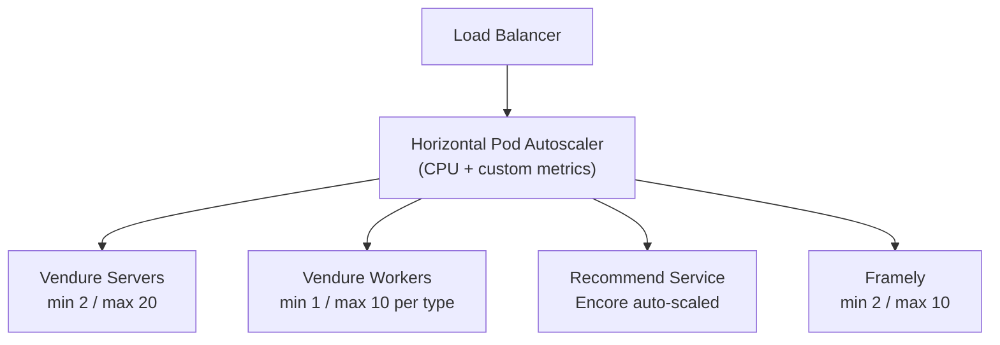

- **Vendure servers**: Scale on CPU utilisation (target 60%) and request queue depth.
- **Vendure workers**: Scale on BullMQ queue depth per worker type.
  Dedicated queues: `search-indexer`, `email`, `asset-sync`, `clamav-scan`.
- **Recommend service**: Encore's built-in autoscaling based on request rate.
- **Framely**: Stateless Next.js scale on concurrent connections.
- **CrowdSec**: Runs as a sidecar / DaemonSet, scales with the pod fleet.

### 13.5 Cost model (estimated monthly, at scale)

| Component                         | Self-hosted estimate | Managed estimate           | Notes                                   |
| --------------------------------- | -------------------- | -------------------------- | --------------------------------------- |
| **Vendure servers** (3 instances) | $150-300             |                            | 2 vCPU / 4GB each                       |
| **Vendure SQL (PostgreSQL)**      | $100-200             | $300-600 (RDS)             | Primary + 2 read replicas               |
| **PgBouncer**                     | $0 (co-located)      |                            | Sidecar on app nodes                    |
| **Redis** (cache + queue)         | $40-80               | $100-200 (Elasticache)     | 2 nodes, 4GB each                       |
| **Typesense** (3-node HA)         | $200-400             | $149-799 (Typesense Cloud) | RAM-bound: size for catalog             |
| **Qdrant** (10M vectors)          | $40-100              | $95-300 (Qdrant Cloud)     | Binary quantisation reduces RAM 4-8×    |
| **Convex**                        |                      | $25-500 (Pro/Business)     | Usage-based: function calls + bandwidth |
| **CDNgine**                       | (separate budget)    |                            | See CDNgine docs                        |
| **Cloudflare** (CDN + Workers)    |                      | $0-20 (Workers Paid)       | 10M requests/mo included                |
| **Stripe fees**                   |                      | 2.9% + $0.30/txn           | Volume discounts available              |
| **Svix** (webhooks)               | $0 (self-hosted)     | $50-300                    | Based on message volume                 |
| **CrowdSec**                      | $0 (OSS)             |                            | Community blocklists free               |
| **Keygen**                        | $0 (self-hosted)     | $49-299                    | Based on license volume                 |
| **Total (self-hosted heavy)**     | **~$550-1,100/mo**   |                            | Excludes Stripe txn fees                |
| **Total (managed heavy)**         |                      | **~$1,000-3,000/mo**       | Excludes Stripe txn fees                |

**Cost guardrails:**

- Convex bandwidth: monitor `bandwidth_used` metric; alert at 80% tier limit.
- Typesense RAM: monitor heap usage; scale nodes before OOM.
- Redis: separate cache cluster (with eviction) from queue cluster (no eviction).
- Qdrant: binary quantisation is mandatory for embeddings >1M vectors.
- CDN: use `stale-while-revalidate` aggressively to reduce origin hits by 80%+.

---

## 14 Extensibility

### 13.1 Vendure plugin system

All Simket-specific business logic is implemented as Vendure plugins. Each
plugin can:

- Define new databse entities (TypeORM).
- Extend the Bebop schema (new message types and service methods via `.bop` files).
- Subscribe to Venure events (e.g., `OrderPlacedEvent`).
- Create job queue processors for worker-side logic.
- Declare custom fields on existing Vendure entities.

A plugin is a NestJS module decorated with `@VendurePlugin()`. This means
standard NestJS patterns (DI, guards, interceptors, middleware) are available.

### 13.2 Recommendation adapter architecture

The recommend service defines three interfaces:

```typescript
interface CandidateSource {
  name: string;
  retrieve(request: RecommendRequest): Promise<Candidate[]>;
}

interface Ranker {
  name: string;
  stage: 'light' | 'heavy';
  rank(candidates: Candidate[], context: RankContext): Promise<ScoredCandidate[]>;
}

interface PostProcessor {
  name: string;
  process(ranked: ScoredCandidate[], context: PostProcessContext): Promise<ScoredCandidate[]>;
}
```

Implementations are registered in a `RecommenderRegistry`. The pipeline
executes them in order:

1. **Retrieve** All registered `CandidateSource`s run in parallel.
   Results are merged and deduplicated.
2. **Light rank** Fast scoring to reduce candidate set (e.g., dot-product
   on pre-computed embeddings via [Voyager](https://github.com/spotify/voyager)).
3. **Heavy rank** ML model scoring on reduced set
   (e.g., [OpenOneRec](https://github.com/Kuaishou-OneRec/OpenOneRec),
   [Meta generative-recommenders](https://github.com/meta-recsys/generative-recommenders)).
4. **Post-process** Diversity injection, business rule filtering
   (e.g., boost products with higher platform take-rate), freshness mixing.

Adding a new recommender = implement one interface + register it. No
pipeline code changes.

### 13.3 Framely component extensions

Framely's element tree is recursive (`EditorElement[]`). To add HeroUI
components to the builder:

1. Define a new `EditorElement` type (e.g., `heroui-button`, `heroui-card`).
2. Register a React renderer for that type.
3. Register property editors for the builder sidebar.
4. The element serialises to JSON like all other elements.

This allows creators to build fully custom store pages using the same
HeroUI components used by the rest of the platform.

### 13.4 Checkout flow extensibility

The Flow plugin stores checkout flow definitions as JSON:

```json
{
  "steps": [
    { "type": "cart-review" },
    { "type": "upsell", "productIds": ["..."] },
    { "type": "payment" },
    { "type": "post-sale-page", "ageId": "..." }
  ]
}
```

Creators can duplicate and customise flows. New step types can be added
by implementing a `FlowStep` interface and rgistering a renderer.

---

## 15 Architectural smells to watch

| Smell                                       | Why it matters                                                                                                               | Guardrail                                                                                                                                                             |
| ------------------------------------------- | ---------------------------------------------------------------------------------------------------------------------------- | --------------------------------------------------------------------------------------------------------------------------------------------------------------------- |
| **CDNgine creep**                           | If Simket starts storing blobs in its own DB, we lose single-source-of-truth for assets.                                     | Lint rule: no `Buffer` or `Blob` columns in Vendure entities.                                                                                                         |
| **God plugin**                              | A single Vendure plugin that grows to own multiple unrelated concerns.                                                       | Each plugin ≤ 1 bounded context. If a plugin needs a new entity unrelated to its core, it's a new plugin.                                                             |
| **Synchronous worker calls**                | Calling a worker operation and awaiting it in the request path.                                                              | Code review rule: `jobQueue.add()` must not be followed by `await job.waitForResult()` in resolvers.                                                                  |
| **Recommend coupling**                      | Storefront directly calls a specific recommender implementation instead of going through the registry.                       | The recommend service API returns `ScoredCandidate[]` it never leaks implementation details.                                                                          |
| **Auth bypass**                             | A new endpoint skips JWT validation because "it's internal".                                                                 | All Vendure resolvers inherit the auth guard. Internal service calls use service tokens with explicit scopes.                                                         |
| **PayloadCMS data leaking into Vendure DB** | Editorial data duplicated into Vendure tables beyond a thin cache.                                                           | Editorial content is fetched and cached with TTL, never migrated into Vendure entities.                                                                               |
| **Framely DB divergence**                   | Framely's Prisma schema and Vendure's TypeORM schema defining overlapping concepts.                                          | Framely stores only page/element data. Product data is always fetched from Vendure API at render time.                                                                |
| **Take-rate in recommendation code**        | Business logic (boost by take-rate %) mixed into ML ranking code.                                                            | Take-rate boost is a `PostProcessor`, not embedded in rankers.                                                                                                        |
| **Convex bandwidth blowup**                 | Full-collection subscriptions or un-paginated queries in Convex can generate 100× expected egress, hitting bandwidth limits. | All Convex queries must be paginated and indexed. Subscribe to specific documents, never collections. Monitor `bandwidth_used` metric alert at 80% tier.              |
| **Cache stampede**                          | All edge/Redis caches expire simultaneously on a hot product, flooding origin.                                               | Use jittered TTLs (±10%). SWR pattern means stale is always served while revalidating.                                                                                |
| **Silent sync drift**                       | A derived store (Typesense, Qdrant, Customer cache) silently diverges from its source of truth. Users see stale/wrong data.  | Reconciliation workers (§9.11.2) run on schedule and emit `reconciliation_drift_count` metric. Any drift > 0 → alert. Fix the real-time pipeline, not just the recon. |
| **Cache overwrite race**                    | Two concurrent mutations write to the same cache key, latest mutation's value lost.                                          | Cache-aside with delete-on-write only (rule §12). Never `SET` a cache key in a mutation handler only `DEL`. Next read populates.                                      |
| **Checkout stale price**                    | Buyer adds item, price changes, buyer pays old price. Revenue loss or trust issue.                                           | Checkout always reads from Vendure SQL directly (rule §13). Cart re-validation at checkout with buyer notification.                                                   |

---

## 16 Open questions

> These are active design questions that should be resolved and documented
> as ADRs in `docs/adr/`.

1. **Search engine tuning** Typesense is the primary search engine with
   native Raft-based HA clustering. Open questions: ranking rule
   configuration, custom synonyms, RAM sizing strategy as catalog grows
   past millions of products. Qdrant handles semantic search separately.
2. **Framely deployment model** Framely as a subdomain per creator
   (`creator.simket.com`) vs path-based (`simket.com/store/creator`).
   Impacts CDN config, SSL, and routing.
3. **Recommendation warm-start** How to serve recommendations for new
   users with no purchase history (cold-start problem). Fallback to
   editorial curation vs popularity-based.
4. **PayloadCMS vs Vendure for tags** Tags are used by both editorial
   (PayloadCMS) and products (Vendure). Which system is the source of truth
   for the tag taxonomy?
5. **Convex vs Vendure job queue boundary** When to use Convex scheduled
   functions / actions (multi-step, durable, long-running, reactive) vs
   Vendure job queue (single-step, fire-and-forget within commerce domain).
   Need a clear decision framework.
6. **Multi-currency and i18n** Vendure supports channels and
   localisation. Decide on day-one locale/currency support vs future.

---

## References

- [Vendure documentation](https://docs.vendure.io/)
- [Vendure plugin system](https://docs.vendure.io/current/core/developer-guide/plugins/)
- [Vendure worker & job queue](https://docs.vendure.io/current/core/developer-guide/worker-job-queue/)
- [HeroUI React docs](https://heroui.com)
- [Framely](https://github.com/belastrittmatter/Framely)
- [TipTap](https://tiptap.dev/)
- [iFramely](https://iframely.com/)
- [Cavalry Web Player](https://cavalry.studio/docs/web-player/)
- [PayloadCMS](https://payloadcms.com/)
- [OpenFeature](https://openfeature.dev/)
- [Backstage](https://backstage.io/)
- [OpenReplay](https://openreplay.com/)
- [Convex](https://convex.dev/)
- [Encore](https://encore.dev/)
- [CDNgine architecture](../../../cdngine/docs/architecture.md)
- [Better Auth documentation](https://www.better-auth.com/docs)
- [Typesense documentation](https://typesense.org/docs)
- [Typesense HA clustering](https://typesense.org/docs/latest/guide/clustering.html)
- [Typesense sizing guide](https://typesense.org/docs/latest/guide/sizing.html)
- [Qdrant documentation](https://qdrant.tech/documentation/)
- [Qdrant binary quantisation](https://qdrant.tech/documentation/guides/quantization/)
- [PgBouncer](https://www.pgbouncer.org)
- [Citus distributed PostgreSQL](https://docs.citusdata.com/)
- [Cloudflare Workers](https://developers.cloudflare.com/workers/)
- [Convex scaling best practices](https://stack.convex.dev/queries-that-scale)
- [Convex production limits](https://docs.convex.dev/production/limits)
- [Bebop schema language](https://bebop.sh/)
- [Cedar policy language](https://www.cedarpolicy.com)
- [Stripe Connect](https://docs.stripe.com/connect)
- [Svix webhooks](https://docs.svix.com)
- [CrowdSec](https://docs.crowdsec.net/)
- [Keygen licensing](https://keygen.sh/docs/)
- [Cockatiel resilience library](https://github.com/connor4312/cockatiel)
- [@nestjs/terminus health checks](https://docs.nestjs.com/recipes/terminus)
- [Circuit breaker pattern (Martin Fowler)](https://martinfowler.com/bliki/CircuitBreaker.html)
- [Kubernetes pod disruption budgets](https://kubernetes.io/docs/tasks/run-application/configure-pdb/)
- [NestJS shutdown hooks](https://docs.nestjs.com/fundamentals/lifecycle-events)
- [Stripe idempotency keys](https://docs.stripe.com/api/idempotent_requests)
- [Convex reactive queries](https://docs.convex.dev/using/reactive-queries)
- [Convex optimistic updates](https://docs.convex.dev/client/react/optimistic-updates)
- [Cloudflare cache purge API](https://developers.cloudflare.com/api/operations/zone-purge)
- [Vendure EventBus](https://docs.vendure.io/guides/developer-guide/events/)
- [Saga pattern](https://microservices.io/patterns/data/saga.html)
