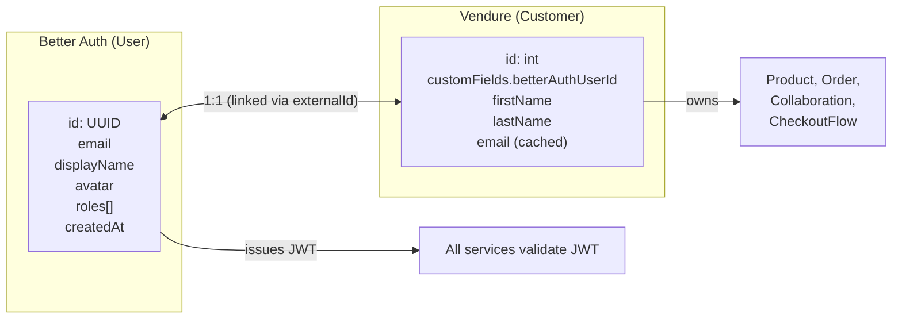
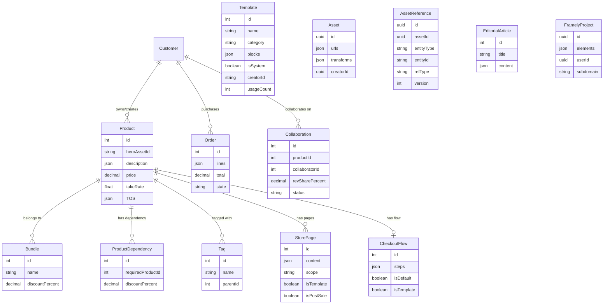

# Simket Domain Model

> **Owner**: Platform team
> **Status**: Living document
> **Audience**: Developers working with Simket's data model

This document defines the core domain entities, their relationships,
identity model, and ownership rules.

---

## 1 Core records

| Entity                  | Owner plugin           | Storage                       | Identity                                         | Purpose                                                                                                  |
| ----------------------- | ---------------------- | ----------------------------- | ------------------------------------------------ | -------------------------------------------------------------------------------------------------------- |
| `Product`               | Catalog                | Vendure DB                    | Vendure auto-increment ID                        | A sellable digital good (Unity package, image pack, template, tool). Extended with Simket custom fields. |
| `ProductVariant`        | Catalog (Vendure core) | Vendure DB                    | Vendure auto-increment ID                        | Price/SKU variant of a product. Simket typically uses a single variant per product.                      |
| `Bundle`                | Bundle                 | Vendure DB                    | Vendure auto-increment ID                        | A group of products sold together at a discount.                                                         |
| `ProductDependency`     | Dependency             | Vendure DB                    | Vendure auto-increment ID                        | A prerequisite relationship: "product X requires ownership of product Y".                                |
| `Collaboration`         | Collaboration          | Vendure DB                    | Vendure auto-increment ID                        | A revenue-sharing agreement between a product owner and collaborators.                                   |
| `CollaborationInvitation` | Collaboration        | Vendure DB                    | UUID                                             | A time-bounded invitation token that proposes a collaborator email, split percentage, and lifecycle state before acceptance creates a Collaboration. |
| `Settlement`            | Collaboration          | Vendure DB                    | UUID                                             | A per-order-line creator earning record tracking pending, processing, completed, or failed Hyperswitch settlement. |
| `Customer`              | Vendure core           | Vendure DB                    | Vendure auto-increment ID + `Better Auth userId` | A marketplace user. Cached profile from Better Auth.                                                     |
| `Order`                 | Vendure core           | Vendure DB                    | Vendure auto-increment ID + order code           | A completed or in-progress purchase.                                                                     |
| `OrderLine`             | Vendure core           | Vendure DB                    | Vendure auto-increment ID                        | A single item in an order.                                                                               |
| `Gift`                  | Gifts                  | Vendure DB                    | Vendure auto-increment ID + unique gift code     | A purchased gift code that can be claimed by another user for a product entitlement.                     |
| `Tag`                   | Tagging                | Vendure DB                    | Vendure auto-increment ID                        | A classification label applied to products.                                                              |
| `StorePage`             | Storefront             | Vendure DB                    | Vendure auto-increment ID                        | A content page (post-sale info, product details).                                                        |
| `Template`              | Storefront             | Vendure DB                    | Vendure auto-increment ID                        | A reusable Framely block preset for store, product, or landing pages.                                   |
| `CheckoutFlow`          | Flow                   | Vendure DB                    | Vendure auto-increment ID                        | A checkout flow definition with ordered steps.                                                           |
| `Experiment`            | AB testing             | Vendure DB                    | UUID                                             | A creator-owned A/B test definition with weighted variants, audience rules, and lifecycle state.         |
| `ExperimentResult`      | AB testing             | Vendure DB                    | UUID                                             | A tracked experiment outcome event (`view`, `click`, `purchase`) attributed to a variant and user.      |
| `FramelyProject`        | Framely                | Framely DB (Prisma)           | UUID                                             | A custom store page built in the Framely editor.                                                         |
| `EditorElement`         | Framely                | Framely DB (Prisma)           | UUID                                             | A single element in a Framely page tree.                                                                 |
| `EditorialArticle`      | Editorial              | PayloadCMS DB                 | PayloadCMS auto ID                               | A "Today" section article written by the editorial team.                                                 |
| `CuratedCollection`     | Editorial              | PayloadCMS DB                 | PayloadCMS auto ID                               | A curated group of products for the editorial section.                                                   |
| `Asset`                 | CDNgine                | CDNgine DB                    | CDNgine asset ID (UUID)                          | A binary artefact (image, video, package file).                                                          |
| `AssetReference`        | Vendure asset refs     | Vendure DB                    | UUID                                             | A persisted reference from a Simket entity slot (`product`, `storePage`, `description`, etc.) to a CDNgine asset ID. |
| `User`                  | Better Auth            | Better Auth DB                | Better Auth user ID (UUID)                       | The canonical identity record.                                                                           |
| `RecommendationProfile` | Recommend              | Recommend service DB / Qdrant | User ID (from Better Auth)                       | User embeddings, interaction history, and preference signals.                                            |
| `License`               | Licensing              | Keygen                        | Keygen license ID (UUID)                         | A software license key tied to a product purchase. Validated via Keygen API.                             |
| `WebhookEndpoint`       | Webhooks               | Svix                          | Svix endpoint ID                                 | A registered webhook URL owned by a creator for receiving events.                                        |
| `AuthorizationPolicy`   | Authorization          | Cedar policy store            | Policy ID                                        | Fine-grained access rules for entitlements, collaborator perms, moderation.                              |
| `SearchDocument`        | Search                 | Typesense                     | Product ID (indexed)                             | A denormalised product document optimised for full-text + faceted search.                                |
| `Embedding`             | Vector store           | Qdrant                        | Point ID (UUID)                                  | A vector embedding of a product for semantic similarity search.                                          |

---

## 2 Identity model

### 2.1 Cross-system identity mapping

| System            | ID field                                                     | Source                                   |
| ----------------- | ------------------------------------------------------------ | ---------------------------------------- |
| Better Auth       | `User.id` (UUID)                                             | Canonical identity                       |
| Vendure           | `Customer.id` (int) + `customFields.betterAuthUserId` (UUID) | Commerce identity, linked to Better Auth |
| CDNgine           | `Asset.creatorId` (UUID = Better Auth User.id)               | Asset ownership                          |
| Recommend service | `userId` (UUID = Better Auth User.id)                        | Preference profile                       |
| PayloadCMS        | `Author.externalId` (UUID = Better Auth User.id)             | Editorial authorship                     |
| Framely           | `Project.userId` (UUID = Better Auth User.id)                | Store page ownership                     |
| Keygen            | `User.id` (UUID = Better Auth User.id)                       | License owner identity                   |

All systems use the Better Auth `User.id` as the foreign key for
cross-system joins. Vendure's internal `Customer.id` is only used
within Vendure's own DB.

---

## 3 Entity relationship diagram

---

## 4 Record responsibilities

### 4.1 Product

The central entity. A product represents a single sellable digital good.

| Responsibility  | Details                                                                                                           |
| --------------- | ----------------------------------------------------------------------------------------------------------------- |
| **Identity**    | Vendure `Product.id`. Slug for URL routing.                                                                       |
| **Pricing**     | Via `ProductVariant`. Single variant per product (unless multi-tier pricing).                                     |
| **Description** | TipTap JSON document stored in `customFields.tiptapDescription`. Supports iFramely embeds and Cavalry web player. |
| **Media**       | `heroAssetId` → CDNgine asset. Optional `heroTransparentAssetId` + `heroBackgroundAssetId` for depth effect.      |
| **Terms**       | `customFields.termsOfService` TipTap JSON.                                                                        |
| **Take rate**   | `customFields.platformTakeRate` minimum 5%. Higher take rate = more recommendation boost.                         |
| **Visibility**  | State machine: Draft → Published → Unpublished → Suspended.                                                       |
| **Ownership**   | Product creator is the Vendure `Customer` who created it.                                                         |
| **Tags**        | Many-to-many via `ProductTag` join table.                                                                         |

### 4.1.1 AssetReference

Tracks where a CDNgine asset is actively used inside Vendure-owned records.

| Responsibility      | Details                                                                                                                           |
| ------------------- | --------------------------------------------------------------------------------------------------------------------------------- |
| **Reference slot**  | `entityType + entityId + refType` identifies where the asset is used (for example product hero, gallery item, inline description). |
| **Usage guard**     | Prevents deletion of in-use CDNgine assets and powers orphan detection.                                                           |
| **Version lineage** | `version` increments when an entity slot replaces one asset with another so cleanup can honor a grace period for old versions.    |
| **Ownership split** | CDNgine owns the binary object; Vendure owns the usage graph and cleanup eligibility.                                             |

### 4.2 Bundle

Groups multiple products into a single purchasable unit.

| Responsibility  | Details                                                                |
| --------------- | ---------------------------------------------------------------------- |
| **Composition** | Many-to-many with `Product`. A product can appear in multiple bundles. |
| **Pricing**     | `discountPercent` applied to the sum of individual product prices.     |
| **Purchase**    | Buying a bundle adds every contained product to the order with integer minor-unit discount allocation per line. |
| **Display**     | Rendered on product pages and in cart review with explicit bundle grouping and savings breakdown. |

### 4.3 ProductDependency

Defines prerequisite relationships between products.

| Responsibility         | Details                                                                                                     |
| ---------------------- | ----------------------------------------------------------------------------------------------------------- |
| **Prerequisite check** | At add-to-cart time, the Dependency plugin verifies the buyer owns the required product.                    |
| **Discount**           | Optional `discountPercent` if the buyer has the prerequisite in their library or current checkout, they get a discount on the dependent product. |
| **UI hint**            | Storefront shows "Requires: [Product X]" with a link and blocks checkout until missing prerequisites are added. |

### 4.3.1 Gift

Tracks a purchased product gift until the recipient claims it.

| Responsibility      | Details                                                                                   |
| ------------------- | ----------------------------------------------------------------------------------------- |
| **Sender**          | `senderUserId` identifies the user who purchased and sent the gift.                       |
| **Recipient**       | `recipientEmail` is captured at send time; `recipientUserId` is populated on claim.       |
| **Code**            | `giftCode` is unique, human-shareable, and claimable exactly once while in `PURCHASED`.   |
| **Lifecycle**       | `PURCHASED` → `CLAIMED`, with administrative terminal states `REVOKED` and `EXPIRED`.     |
| **Product linkage** | `productId` points at the product entitlement that will be granted when the gift is used. |

### 4.4 Collaboration

Revenue-sharing agreement between product creators.

| Responsibility    | Details                                                                                        |
| ----------------- | ---------------------------------------------------------------------------------------------- |
| **Revenue split** | `revenueSharePercent` per collaborator. Owner's share = 100% minus sum of collaborator shares. |
| **Lifecycle**     | Pending → Invited → Active → Revoked.                                                          |

### 4.4.1 Settlement

Tracks what each creator is owed after a paid collaborative order.

| Responsibility        | Details                                                                                                       |
| --------------------- | ------------------------------------------------------------------------------------------------------------- |
| **Granularity**       | One record per order line per creator owed revenue.                                                           |
| **Amounts**           | Stored in smallest currency unit (integer cents).                                                             |
| **Rounding**          | Collaborator shares round down per line; the product owner receives the remainder so the line total is exact. |
| **Stripe linkage**    | Stores connected account ID, transfer group, source transaction, and transfer reference for reconciliation.   |
| **Lifecycle**         | Pending → Processing → Completed / Failed.                                                                    |
| **Creator reporting** | Powers creator earnings and settlement history queries in the admin API.                                      |
| **Settlement**    | Convex action processes payouts on each order.                                                 |
| **Invitation**    | Convex action with scheduled timeout.                                                          |

### 4.4.1 CollaborationInvitation

Persisted invitation state for collaboration onboarding before an active split exists.

| Responsibility      | Details                                                                 |
| ------------------- | ----------------------------------------------------------------------- |
| **Invitee target**  | Stores `inviteeEmail` until acceptance resolves a Better Auth user ID.  |
| **Lifecycle**       | Pending → Accepted / Declined / Expired / Revoked.                      |
| **Expiry**          | Invitation tokens expire after 7 days and must not be accepted after that point. |
| **Split proposal**  | `splitPercent` is validated against existing active collaborations so totals stay ≤ 100%. |
| **Acceptance**      | Accepting an invitation creates the corresponding `Collaboration` record. |

### 4.5 StorePage

Content pages associated with product or the platform.

| Responsibility | Details                                                                       |
| -------------- | ----------------------------------------------------------------------------- |
| **Scope**      | `universal` (visible on all products) or `product` (specific to one product). |
| **Post-sale**  | `isPostSale: true` only visible to buyers who own the product.                |
| **Templates**  | `isTemplate: true` can be duplicated to create new pages.                     |
| **Content**    | TipTap JSON document with rich text, embeds, and media.                       |
| **Ordering**   | `sortOrder` controls display sequence.                                        |

### 4.6 Template

Reusable builder presets for creator storefront work.

| Responsibility | Details                                                                                      |
| -------------- | -------------------------------------------------------------------------------------------- |
| **Category**   | Classified as `store-page`, `product-page`, or `landing-page` for gallery filtering.        |
| **Blocks**     | Stores the canonical Framely block array copied from an existing persisted page.             |
| **Ownership**  | `isSystem: true` means the template is platform-provided; otherwise `creatorId` owns it.    |
| **Reuse**      | Can be applied directly into the page builder and duplicated into new creator-owned entries. |
| **Popularity** | `usageCount` tracks how often the template is chosen so galleries can rank proven starters.  |

### 4.7 CheckoutFlow

Defines the steps a buyer goes throug during checkout.

| Responsibility | Details                                                                                  |
| -------------- | ---------------------------------------------------------------------------------------- |
| **Steps**      | Ordered array of typed steps (cart-review, upsell, cross-sell, payment, post-sale-page). |
| **Scoping**    | Can be product-specific or the default flow.                                             |
| **Templates**  | `isTemplate: true` can be duplicated.                                                    |
| **Execution**  | The Flow plugin renders the appropriate step UI and manages step transitions.            |

### 4.8 Tag

Classification labels for products.

| Responsibility      | Details                                                      |
| ------------------- | ------------------------------------------------------------ |
| **Hierarchy**       | Tags can have parent tags (tree structure).                  |
| **Enforcement**     | Minimum required tags per product (configurable).            |
| **Search**          | Tags feed into the search index for faceted search.          |
| **Recommendations** | Tags are a signal for the recommendation pipeline.           |
| **Editorial**       | Tags can be cross-referenced with PayloadCMS editorial tags. |

---

## 5 Custom field registry

All Vendure custom fields defined by Simket plugins:

### 5.1 Product custom fields

| Field                    | Type          | Plugin     | Description                                      |
| ------------------------ | ------------- | ---------- | ------------------------------------------------ |
| `heroAssetId`            | `string`      | Catalog    | CDNgine asset ID for hero image/video            |
| `heroTransparentAssetId` | `string?`     | Catalog    | CDNgine asset ID for transparent overlay         |
| `heroBackgroundAssetId`  | `string?`     | Catalog    | CDNgine asset ID for background                  |
| `tiptapDescription`      | `text` (JSON) | Catalog    | TipTap document for product description          |
| `termsOfService`         | `text` (JSON) | Catalog    | TipTap document for terms of service             |
| `platformTakeRate`       | `float`       | Catalog    | Platform commission percentage (min 5%)          |
| `creatorId`              | `string`      | Catalog    | Better Auth user ID of the product creator       |
| `useFramelyStore`        | `boolean`     | Storefront | Whether this product uses a custom Framely store |
| `framelyProjectId`       | `string?`     | Storefront | Framely project UUID (if custom store)           |

### 5.2 Customer custom fields

| Field              | Type         | Plugin   | Description                                |
| ------------------ | ------------ | -------- | ------------------------------------------ |
| `betterAuthUserId` | `string`     | Catalog  | Better Auth user ID (canonical identity)   |
| `isCreator`        | `boolean`    | Catalog  | Whether this user has creator capabilities |
| `wishlistItems`    | `relation[]` | (future) | Wishlist functionality                     |

### 5.3 OrderLine custom fields

| Field                       | Type      | Plugin     | Description                                     |
| --------------------------- | --------- | ---------- | ----------------------------------------------- |
| `bundleId`                  | `string?` | Bundle     | If this line item was added as part of a bundle |
| `dependencyDiscountApplied` | `boolean` | Dependency | Whether a dependency discount was applied       |

---

## 6 Invariants

These invariants must hold at all tmes:

1. **Collaboration shares sum to ≤ 100%** The sum of all
   `Collaboration.reveueSharePercent` for a product must not exceed
   100%. The owner receives the remainder.

2. **Dependency cycle prevention** Product dependencies must not form
   cycles. The Dependency pugin validates this on create/update.

3. **Bundle minimum** A bundle must contain at least 2 products.

4. **Take rate floor** `platformTakeRate` must be ≥ 5.0.

5. **Hero asset required** product cannot be published without a
   `heroAssetId` pointing to a valid CDNgine asset.

6. **Single canonical identity** Every `Customer` has exactly one
   `betterAuthUserId`. No twocustomers share the same `betterAuthUserId`.

7. **Post-sale page access** Store pages with `isPostSale: true` are
   only accessible to customers who have a completed order containing
   the associated product.

8. **Template immutability** Store pages and checkout flows with
   `isTemplate: true` are read-only for non-admin users. They can
   only be duplicated.

---

## References

- [Vendure entities](https://docs.vendure.io/current/core/developer-guide/database-entity/)
- [Vendure custom fields](https://docs.vendure.io/current/core/developer-guide/custom-fields/)
- [TypeORM entity documentation](https://typeorm.io/entities)
- [CDNgine domain model](../../../cdngine/docs/domain-model.md)
- [Better Auth documentation](https://www.better-auth.com/docs)
