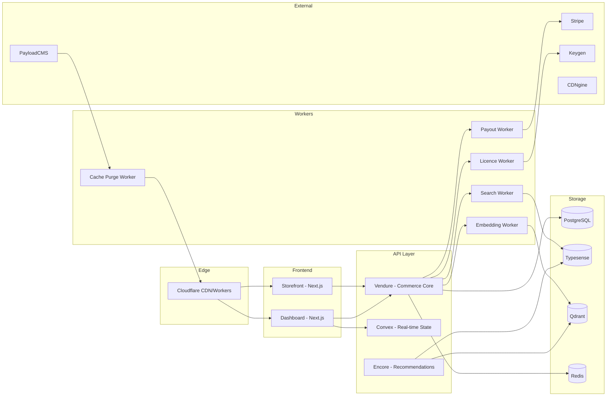

# Interfaces And Data Flow

This document maps Simket's service boundaries and data flows.

## 1. External ingress map

| Input source      | Entrypoint                           | Owner                  | Outputs                                          |
| ----------------- | ------------------------------------ | ---------------------- | ------------------------------------------------ |
| Buyer (browser)   | Storefront Next.js app               | Storefront             | HTML/JS, product pages, cart, checkout           |
| Creator (browser) | Dashboard Next.js app                | Dashboard              | Creator tools, product management, analytics     |
| Buyer (API)       | Vendure Bebop API                    | Vendure                | Product data, orders, cart operations            |
| Creator (API)     | Convex functions + Vendure admin API | Convex + Vendure       | Dashboard state, product CRUD                    |
| Payment webhook   | Stripe webhook endpoint              | Payment service        | Order confirmation, payout triggers              |
| Asset upload      | CDNgine tus endpoint                 | CDNgine                | Upload sessions, processed artefacts             |
| Editorial publish | PayloadCMS webhook                   | Editorial worker       | Cache purge, featured content update             |
| Search query      | Typesense search API (proxied)       | Search service         | Search results, faceted navigation               |
| Recommendation    | Encore recommendation API            | Recommendation service | Personalised product lists                       |
| External webhook  | Svix inbound endpoint                | Webhook service        | Event dispatch to consumers                      |
| Admin operator    | Backstage admin portal               | Admin service          | Diagnostics, user management, content moderation |

## 2. Internal service contracts

### Synchronous (Bebop RPC)

| Caller      | Callee      | Contract                               | Purpose                 |
| ----------- | ----------- | -------------------------------------- | ----------------------- |
| Storefront  | Vendure     | Product, Cart, Order messages          | Browse, cart, checkout  |
| Dashboard   | Convex      | Creator, Collaboration, Flow functions | Real-time creator state |
| Dashboard   | Vendure     | Product admin messages                 | Product CRUD            |
| Any service | Cedar       | PolicyDecision message                 | Authorisation check     |
| Any service | Better Auth | SessionVerify message                  | Authentication          |
| Checkout    | Stripe      | Stripe SDK                             | Payment processing      |
| Checkout    | Keygen      | LicenceCreate message                  | Licence issuance        |

### Asynchronous (BullMQ events)

| Producer   | Event                           | Consumer                | Idempotency strategy                          |
| ---------- | ------------------------------- | ----------------------- | --------------------------------------------- |
| Vendure    | product.created/updated/deleted | Search index worker     | Typesense upsert is idempotent by document ID |
| Vendure    | product.created/updated         | Embedding worker        | Qdrant upsert by point ID                     |
| Vendure    | order.placed                    | Payout worker           | Stripe idempotency key = order ID             |
| Vendure    | order.placed                    | Licence worker          | Keygen idempotency key = order item ID        |
| CDNgine    | asset.processed                 | Vendure asset linker    | Asset ID upsert                               |
| PayloadCMS | editorial.published             | Cache purge worker      | Purge-by-tag is idempotent                    |
| Stripe     | payment_intent.succeeded        | Order fulfilment worker | Stripe event.id dedup in Redis (7-day TTL)    |
| Svix       | webhook.delivered/failed        | Webhook analytics       | Message ID dedup                              |

## 3. Mapping rules

1. Every API group has a named owner.
2. Every request/response shape must be defined in Bebop schemas and versionable.
3. Every async flow names its producer, consumer, idempotency strategy, and retry owner.
4. Every input is validated at the first boundary.
5. Every output must be explainable without reading controller internals.

## 4. Boundary warning signs

The following are contract failures:

- Service-local storage semantics leaking into public API payloads
- Convex function internals exposed as stable buyer-facing contracts
- Provider-specific terms (e.g., Stripe internal IDs) leaking into generic product resources
- Redis state treated as durable business truth
- Vendure plugin internals leaking into dashboard Convex functions
- Recommendation service internals leaking into storefront API responses

## 5. Data flow diagram

