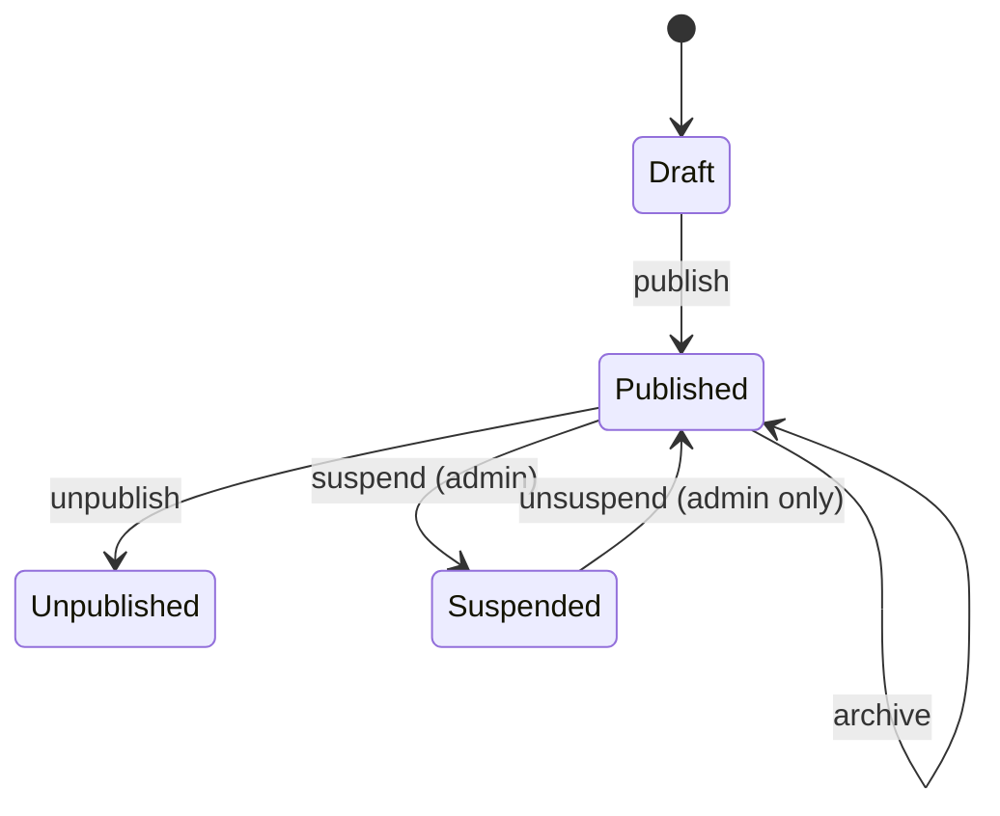
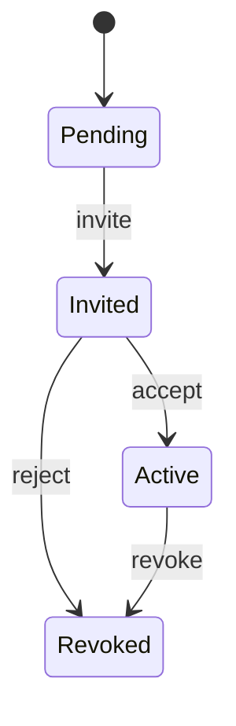
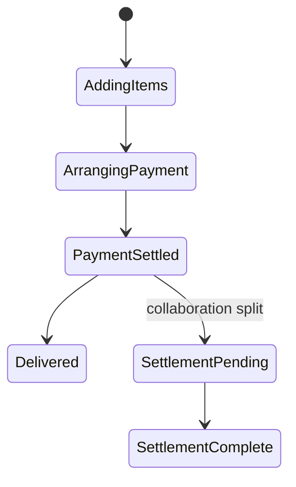
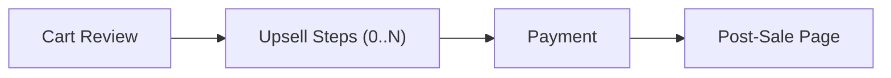
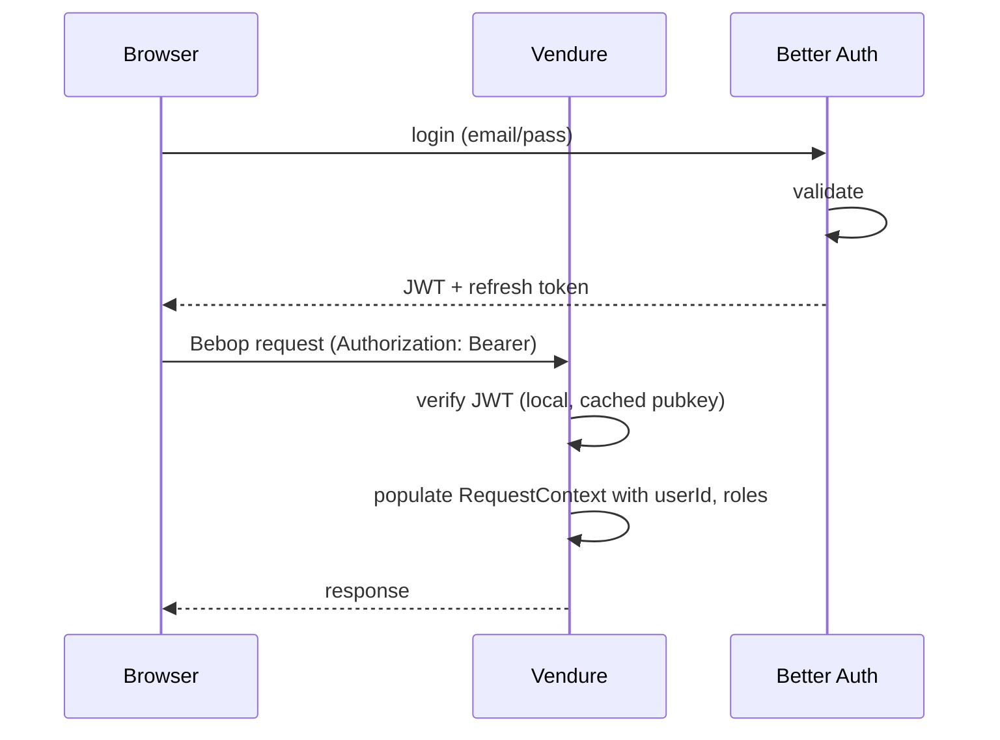
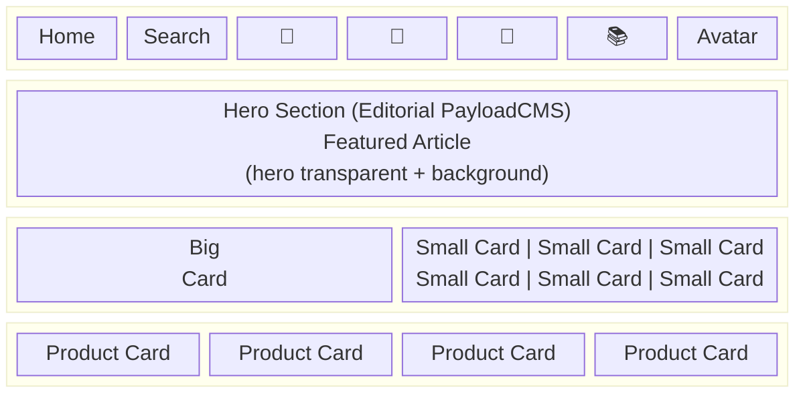
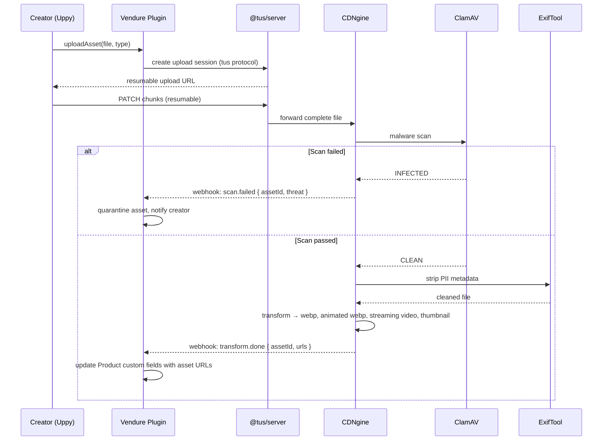

# Simket  Service Architecture

> **Owner**: Platform team
> **Status**: Living document
> **Audience**: Developers implementing Vendure plugins, service integrations,
> and client features

This document describes the service-level architecture of Simket  the
contracts, boundaries, and interaction patterns between services.

---

## 1 Service surfaces

### 1.1 Vendure Bebop gateway

The primary API surface. All client-facing operations go through Vendure's
Bebop API, extended by Simket plugins. Vendure's internal resolver layer is
adapted via a Bebop translation layer that maps `.bop` schemas to Vendure
resolvers, replacing the default GraphQL transport with compact binary messages.

| API | Audience | Auth | Examples |
|-----|----------|------|----------|
| **Shop API** | Buyers, anonymous | JWT (optional for browse) | `products`, `addToCart`, `checkout`, `discoverFeed`, `activeCustomerLibrary` |
| **Admin API** | Creators, platform admins | JWT + role permissions | `createProduct`, `updateCollaboration`, `manageFlows`, `publishProduct` |

Both APIs are served from the same Vendure server process on different
Bebop endpoints (`/shop-api`, `/admin-api`).

### 1.2 Recommend service API (internal)

Exposed as an Encore service. Not directly accessible by clients.

```
POST /recommend/candidates
  Request:  { userId, context: { recentPurchases, tags, sessionSignals } }
  Response: { candidates: [{ productId, score, source, metadata }] }

POST /recommend/feedback
  Request:  { userId, productId, action: "click" | "purchase" | "dismiss" }
  Response: { ok: true }
```

The Vendure gateway plugin calls this service and hydrates the response
with full product data before returning to the client.

### 1.3 CDNgine API (internal)

See [cdngine service-architecture.md](../../../cdngine/docs/service-architecture.md)
for full contract details.

Key operations used by Simket:

| Operation | Simket usage |
|-----------|-------------|
| `POST /upload/presign` | Generate pre-signed upload URL for creator assets |
| `POST /transform` | Request asset transformation (image → webp, video → streaming) |
| `GET /asset/:id/meta` | Fetch asset metadata (dimensions, format, URLs) |
| Webhook: `transform.complete` | Notify Simket that asset transformation is done |

### 1.4 Better Auth API

See [Better Auth documentation](https://www.better-auth.com/docs)
for full contract details.

Key operations consumed:

| Operation | Simket usage |
|-----------|-------------|
| JWT verification (public key) | Validate tokens on every authenticated request |
| `GET /users/:id/profile` | Fetch user profile for Customer entity cache |
| Webhook: `user.created` | Create corresponding Vendure Customer record |
| Webhook: `user.updated` | Sync profile changes to Vendure Customer cache |

### 1.5 PayloadCMS API

| Operation | Simket usage |
|-----------|-------------|
| `GET /api/articles?status=published&sort=-publishDate&limit=10` | Fetch "Today" section content |
| `GET /api/articles/:id` | Fetch individual article with full TipTap content |
| `GET /api/curated-collections` | Fetch editorial collections for homepage |
| Webhook: `article.published` | Trigger cache invalidation in Vendure |

### 1.6 Convex functions (database + workflows)

| Function | Trigger | Steps |
|----------|---------|-------|
| `collaborationSettlement` (action) | `OrderPlacedEvent` (for collaborative products) | 1. Calculate revenue split per collaborator %. 2. Initiate Stripe Connect destination payouts. 3. Record settlement. 4. Dispatch Svix webhook. |
| `collaborationInvite` (action) | Creator adds collaborator to product | 1. Send invite. 2. Wait for accept/reject (polled via mutation). 3. Update collaboration record. 4. Timeout after N days (scheduled function). |
| `scheduledReindex` (scheduled) | Cron (daily) | 1. Trigger recommend model retrain. 2. Rebuild Typesense index. 3. Refresh editorial cache. 4. Refresh Qdrant embeddings. |
| `gdprDelete` (action) | Admin action | 1. Delete from Better Auth. 2. Anonymise Vendure Customer. 3. Remove from recommend service + Qdrant. 4. Purge CDNgine assets. 5. Revoke Keygen licenses. |
| `complexCheckout` (action) | Checkout with custom flow | 1. Evaluate Cedar entitlement policies. 2. Execute flow steps in sequence. 3. Handle upsell acceptance/rejection. 4. Finalise payment via Stripe Connect. 5. Grant access. 6. Create Keygen license (if software product). |

### 1.7 Svix (webhook delivery)

All outbound events from Simket are delivered through Svix. Creators and
integrators register webhook endpoints in the creator dashboard.

| Operation | Simket usage |
|-----------|-------------|
| Create message | Dispatch events: `order.completed`, `product.published`, `collaboration.settled`, `license.activated` |
| Endpoint management | Creator dashboard → register/edit webhook endpoints |
| Delivery status | Observe delivery logs, retry failures |

Svix provides cryptographic signing (HMAC), automatic retries with
exponential back-off, and a delivery dashboard.

### 1.8 Typesense

Typesense runs as a **3-node Raft-based HA cluster** with all data in memory.
Chosen over MeiliSearch because MeiliSearch OSS has no clustering/HA support.

| Operation | Simket usage |
|-----------|-------------|
| Index documents | Product CRUD → sync products to Typesense (batch import API for bulk) |
| Search | Full-text search with typo tolerance, faceted filtering by category/tag/price. Sub-50ms p95. |
| Facet distribution | Sidebar filter counts for marketplace discovery |
| Settings | Configure ranking rules, searchable attributes, filterable attributes |
| Cluster health | Raft consensus health, node failover detection |

**Scaling notes:**
- All indexed data must fit in RAM. Size nodes based on catalog size.
- Add read replica nodes for additional search throughput.
- Enterprise sharding available for >10M documents.
- Only index fields used for search/sort/filter  not full product data.

### 1.9 Qdrant (vector search)

Qdrant is self-hosted for cost efficiency. Binary quantisation reduces
memory 4-8× with minimal recall loss.

| Operation | Simket usage |
|-----------|-------------|
| Upsert points | On product create/update, compute embeddings → store in Qdrant |
| Search (ANN) | "More like this" and semantic discovery queries from Recommend service. p50 ~3ms, p95 ~8ms. |
| Collection management | Create/manage collections per embedding model version |
| Binary quantisation | Mandatory for embeddings >1M vectors. Reduces RAM from ~40GB to ~5-10GB for 10M vectors. |

### 1.10 Cedar (authorization)

Cedar policies are evaluated in-process (embedded engine) with
microsecond latency:

| Policy domain | Example rule |
|--------------|-------------|
| **Entitlements** | `permit(principal, action == "download", resource) when { principal.purchases contains resource.productId }` |
| **Collaborator perms** | `permit(principal, action == "editProduct", resource) when { resource.collaborators contains principal.id }` |
| **Moderation** | `forbid(principal, action == "publish", resource) when { resource.moderationStatus == "held" }` |

Policies are version-controlled and deployed alongside the service code.

### 1.11 Keygen (licensing)

| Operation | Simket usage |
|-----------|-------------|
| Create license | On order completion for software products |
| Validate license | Client-side activation, offline validation |
| List entitlements | Creator dashboard → view active licenses per product |
| Revoke license | Refund or GDPR flows |

### 1.12 Scalar (API docs)

Scalar renders interactive API documentation from Bebop schema definitions
and REST endpoint specs. Deployed at `/docs` on the public API gateway.
Complementary to the Backstage developer portal for internal service docs.

---

## 2 Vendure plugin contracts

Each Simket plugin follows these conventions:

### 2.1 Plugin file stucture

```
plugins/
  <plugin-name>/
    src/
      <plugin-name>.plugin.ts      # @VendurePlugin() decorated class
      api/
        api-extensions.bop          # Bebop schema extensions (.bop)
        <name>.resolver.ts          # Bebop resolvers
      entities/
        <entity>.entity.ts          # TypeORM entities
      services/
        <name>.service.ts           # Business logic
      types/
        custom-fields.d.ts          # Custom field type declarations
      events/
        <name>.event.ts             # Custom event classes
      jobs/
        <name>.job.ts               # Job queue processors
```

### 2.2 Plugin registration

All plugins are registered in the Vendure config:

```typescript
// vendure-config.ts
import { CatalogPlugin } from './plugins/catalog/src/catalog.plugin';
import { BundlePlugin } from './plugins/bundle/src/bundle.plugin';
import { DependencyPlugin } from './plugins/dependency/src/dependency.plugin';
import { CollaborationPlugin } from './plugins/collaboration/src/collaboration.plugin';
import { TaggingPlugin } from './plugins/tagging/src/tagging.plugin';
import { FlowPlugin } from './plugins/flow/src/flow.plugin';
import { StorefrontPlugin } from './plugins/storefront/src/storefront.plugin';
import { RecommendPlugin } from './plugins/recommend/src/recommend.plugin';

export const config: VendureConfig = {
  plugins: [
    CatalogPlugin,
    BundlePlugin,
    DependencyPlugin,
    CollaborationPlugin,
    TaggingPlugin,
    FlowPlugin,
    StorefrontPlugin,
    RecommendPlugin,
    // ... core Vendure plugins
    DefaultJobQueuePlugin,
    DefaultSearchPlugin,
    AssetServerPlugin,
  ],
};
```

### 2.3 Inter-plugin communication

Plugins communicate through:

1. **Vendure events**  `EventBus.publish(new CustomEvent(...))`.
   Subscribers in other plugins react to these events.
2. **Service injection**  Plugin A can inject Plugin B's service if
   Plugin B exports it. Used sparingly to avoid coupling.
3. **Shared entities via custom fields**  Plugin A adds custom fields
   to an entity ownd by Vendure core (e.g., adding `bundleId` to
   `OrderLine`).

Plugins **must not** directly access another plugin's database tables.

---

## 3 Request-path posture

### 3.1 Bebop message size limits

All Bebop requests are validated for message size before execution.
Maximum message size is configurable per API (Shop vs Admin).

```typescript
// Message size limits (bytes)
const SHOP_API_MAX_MSG_SIZE = 64 * 1024;   // 64 KB
const ADMIN_API_MAX_MSG_SIZE = 256 * 1024; // 256 KB
```

Deeply nested response shapes (e.g., `products → variants → assets → transforms`)
use pagination and lazy fields to prevent over-fetching.

### 3.2 DataLoader pattern

All resolvers that load related entities must use DataLoaders to batch
database queries. Vendure provides built-in DataLoader support via
`TransactionalConnection.getRepository()` with eager relations, but
custom resolvers must implement their own batching for custom entities.

### 3.3 Response caching

| Endpoint | Cache | TTL | Invalidation |
|----------|-------|-----|-------------|
| Product detail | CDN + in-memory | 5 min | On product update event |
| Product list / search | In-memory | 1 min | On search index rebuild |
| Editorial ("Today") | In-memory | 10 min | On PayloadCMS webhook |
| Discover feed | Per-user, in-memory | 5 min | On new purchase by user |
| Cart state | No cache |  |  |
| Checkout | No cache |  |  |

---

## 4 Consistency model

### 4.1 Strong consistency

The following operations require strong consistency (single DB transaction):

- **Order placement**  Cart → Order transition, inventory check, and
  payment record must be atomic.
- **Collaboration creation**  Product + Collaboration entity creation
  must be atomic.
- **Bundle modification**  Adding/removing products from a bundle.
- **Cart price validation**  Checkout always reads current prices from
  Vendure SQL (never cache). If prices changed since cart-add, the user
  is notified before payment.

### 4.2 Eventual consistency

The following are eventually consistent:

- **Search index**  Updated asynchronously via job queue after product
  changes. Lag: < 5s. afety net: daily full reindex.
- **Vector embeddings**  Upated asynchronously after product text changes.
  Lag: < 30s. Safety net: daily full re-embed.
- **Recommendation scores**  Udated by scheduled retrain workflows.
  Lag: hours.
- **Edge cache**  Invalidated by Cloudflare purge API on mutation.
  Lag: < 10s (purge propagation). Safety net: SWR + TTL (5-15min).
- **Redis app cache**  Invalidated on write (cache-aside). Lag: < 1s.
  Safety net: TTL (5-15min).
- **Editorial cache**  Refreshed on webhook or TTL expiry. Lag: < 30s
  (webhook) / ≤ 5min (TTL).
- **Customer profile sync**  Better Auth → Vendure Customer. Lag:
  < 5s (webhook) / < 24h (scheduled sync fallback).
- **Collaboration settlement**  Convex action processes payouts
  asynchronously. Lag: minutes to hours.

### 4.3 Idempotency

All mutations that trigger side effects must be idempotent:

- Payment charges use Stripe idempotency keys.
- Job queue jobs are deduplicated by job ID (entity ID + event type).
- Convex functions use deterministic IDs derived from the
  triggering event (e.g., `settlement-order-{orderId}`).
- Webhook handlers store `event.id` in Redis (7-day TTL) and skip
  duplicates.
- Typesense indexing uses `upsert`  same document ID overwrites.

### 4.4 Conflict resolution

| Scenario | Strategy |
|----------|----------|
| **Two creators edit same product** | Optimistic locking (entity version column). Second save gets `409 Conflict` → reload and retry. |
| **Framely page concurrent edits** | Hocuspocus (Yjs CRDT) merges at character level in real time. No conflicts. |
| **TipTap description concurrent edits** | Same as Framely if Hocuspocus enabled. Otherwise optimistic locking. |
| **Cart price changed before checkout** | Cart is re-validated at checkout. User sees _"Price updated"_ notice with new amount. |
| **Cache write race** | Cache-aside with delete-on-write (never overwrite). Next read populates. Race conditions bounded by TTL. |

### 4.5 Reconciliation

Every eventually-consistent derived store has a scheduled reconciliation
worker that detects and repairs drift. See architecture.md §9.11.2 for
the full reconciliation schedule and methods.

---

## 5 State machines

### 5.1 Product lifecycle



| State | Visibility | Purchasable | Editable |
|-------|-----------|-------------|----------|
| **Draft** | Creator only | No | Yes |
| **Published** | Everyone | Yes | Yes (changes trigger re-index) |
| **Unpublished** | Creator only | No (existing buyers retain access) | Yes |
| **Suspended** | No one | No | No (admin action required) |

### 5.2 Collaboration lifecycle



### 5.3 Order lifecycle

Uses Vendure's built-in order state machine, extended with:



### 5.4 Checkout flow execution



---

## 6 Auth posture

### 6.1 Token flow



### 6.2 Role mapping

| Better Auth role | Vendure role | Permissions |
|---------------------|-------------|-------------|
| `user` | `Customer` | Shop API access |
| `creator` | `Creator` (custom) | Admin API subset: own products, collaborations, flows |
| `editor` | `Editor` (custom) | PayloadCMS access, editorial management |
| `admin` | `SuperAdmin` | Full Admin API access |

### 6.3 Service-to-service auth

Internal service calls (Vendure → Recommend service, Vendure → CDNgine)
use short-lived service tokens with explicit scopes. These tokens are
issued by Better Auth with the `service` grant type and are validated
by each downstream service.

---

## 7 Package-specific posture

### 7.1 Catalog plugin

**Entity**: `SimketProduct` (extends Vendure `Product` via custom fields)

Custom fields added to Vendure's `Product`:

| Field | Type | Description |
|-------|------|-------------|
| `heroAssetId` | `string` | CDNgine asset ID for the hero image/video |
| `heroTransparentAssetId` | `string \| null` | CDNgine asset ID for transparent overlay |
| `heroBackgroundAssetId` | `string \| null` | CDNgine asset ID for background |
| `tiptapDescription` | `json` | TipTap JSON document for the description |
| `termsOfService` | `json` | TipTap JSON document for TOS |
| `platformTakeRate` | `float` | Platform commission % (min 5%) |
| `postSalePages` | `relation[]` | Links to `PostSalePage` entities |

**Schema extensions** (`product-extensions.bop`):

```bebop
message AssetDeliveryInfo {
  1 -> string webpUrl;
  2 -> string animatedWebpUrl;
  3 -> string videoUrl;
  4 -> string thumbnailUrl;
  5 -> int32 width;
  6 -> int32 height;
}

message ProductExtension {
  1 -> AssetDeliveryInfo heroAsset;
  2 -> AssetDeliveryInfo heroTransparentAsset;
  3 -> string descriptionTiptapJson;
  4 -> string termsOfServiceJson;
  5 -> float64 platformTakeRate;
  6 -> PostSalePage[] postSalePages;
}
```

### 7.2 Bundle plugin

**Entity**: `Bundle`

```typescript
@Entity()
class Bundle extends VendureEntity {
  @Column() name: string;
  @Column('json') description: TipTapDocument;
  @ManyToMany(() => Product) products: Product[];
  @Column('decimal') discountPercent: number;  // bundle discount
  @Column() isActive: boolean;
}
```

**Bebop schema** (`bundle.bop`):

```bebop
message Bundle {
  1 -> guid id;
  2 -> string name;
  3 -> Product[] products;
  4 -> float64 discountPercent;
  5 -> int64 totalPrice;       // computed: sum of products minus discount (cents)
  6 -> bool isActive;
}

message CreateBundleRequest {
  1 -> string name;
  2 -> guid[] productIds;
  3 -> float64 discountPercent;
}

message UpdateBundleRequest {
  1 -> guid id;
  2 -> string name;
  3 -> guid[] productIds;
  4 -> float64 discountPercent;
}
```

### 7.3 Dependency plugin

**Entity**: `ProductDependency`

```typescript
@Entity()
class ProductDependency extends VendureEntity {
  @ManyToOne(() => Product) product: Product;         // the product being sold
  @ManyToOne(() => Product) requiredProduct: Product;  // must own this first
  @Column('decimal', { nullable: true }) discountPercent: number | null;
}
```

**Checkout guard**: Before adding a product to cart, the dependency plugin
checks if the buyer owns all required products. If not, it returns a
`DependencyNotMetError` union type with the list of missing products.

### 7.4 Collaboration plugin

**Entity**: `Collaboration`

```typescript
@Entity()
class Collaboration extends VendureEntity {
  @ManyToOne(() => Product) product: Product;
  @ManyToOne(() => Customer) collaborator: Customer;  // the invited creator
  @Column('decimal') revenueSharePercent: number;     // e.g., 30.00
  @Column() status: 'pending' | 'invited' | 'active' | 'revoked';
  @Column({ nullable: true }) invitedAt: Date;
  @Column({ nullable: true }) acceptedAt: Date;
}
```

**Constraint**: The sum of all `revenueSharePercent` for a product
(including the owner's implicit share) must equal 100%.

**Settlement**: On order placement, the Collaboration plugin emits a
`CollaborationSettlementEvent`. A Convex action picks this up and
processes payouts to each collaborator's **Stripe Connect** connected
account via destination charges. Each collaborator must have a verified
Stripe Connect account linked through the creator dashboard.

### 7.5 Tagging plugin

**Entity**: `ProductTag` (extends Vendure's built-in `Tag`)

Additional capabilities:
- Tag hierarchy (parent/child relationships).
- Tag suggestions (auto-suggest based on product description via ML).
- Tag enforcement rules (minimum tags per product, required tag categories).
- Cross-reference with PayloadCMS editorial tags.

### 7.6 Flow plugin

**Entity**: `CheckoutFlow`

```typescript
@Entity()
class CheckoutFlow extends VendureEntity {
  @Column() name: string;
  @Column('json') steps: FlowStep[];
  @ManyToOne(() => Product, { nullable: true }) product: Product | null;
  @Column() isDefault: boolean;  // used when no prduct-specific flow exists
  @Column() isTemplate: boolean; // can be duplicated
}

type FlowStep = {
  type: 'cart-review' | 'upsell' | 'cross-sell' | 'payment' | 'post-sale-page';
  config: Record<string, unknown>;
};
```

### 7.7 Storefront plugin

Manages page templates and configurations:

**Entity**: `StorePage`

```typescript
@Entity()
class StorePage extends VendureEntity {
  @Column() title: string;
  @Column('json') content: TipTapDocument;
  @Column() scope: 'universal' | 'product';
  @ManyToOne(() => Product, { nullable: true }) product: Product | null;
  @Column() isTemplate: boolean;
  @Column() isPostSale: boolean;  // only visible after purchase
  @Column() sortOrder: number;
}
```

**Template duplication**: `duplicateStorePage(id)`  creates
a deep copy of a page, including its TipTap content, with `isTemplate: false`.

### 7.8 Recommend plugin (Vendure side)

This plugin is the **Vendure-side adapter** for the external Recommend
service (Encore). It:

1. Exposes a `discoverFeed` query on the Shop API.
2. Calls the Recommend service's internal API with user context.
3. Hydrates the returned product IDs with full Product data.
4. Applies Vendure-side access control (e.g., hide suspended products).

```bebop
message DiscoverFeedRequest {
  1 -> string cursor;
  2 -> int32 limit;
}

message DiscoverFeedResult {
  1 -> DiscoverFeedItem[] items;
  2 -> string nextCursor;
  3 -> bool hasMore;
}

message DiscoverFeedItem {
  1 -> Product product;
  2 -> float64 score;
  3 -> string source;   // which recommender produced this
}
```

---

## 8 Client architecture

### 8.1 Main marketplace page



> **Layout**: Top bar → Hero section → Today Line (horizontal scroll, 1 big + 4 small per row) → Discover section (infinite scroll grid, 4 cards per row).

### 8.2 Top bar navigation

| Element | Action |
|---------|--------|
| **Home** | Navigate to marketplace homepage |
| **Search** | Open search overlay (full-text via Typesense: in-memory, typo-tolerant, faceted, sub-50ms) |
| **🌙 / ☀️** | Toggle dark/light mode (HeroUI theme) |
| **🛒 Cart** | Open cart drawer |
| **🔔 Notifications** | Open notifications panel (order updates, collaboration invites) |
| **📚 Library** | View purchased products |
| **Avatar** | Profile dropdown: Inventory, Account Settings, Creator Dashboard |

### 8.3 Creator dashboard

```mermaid
block-beta
    columns 5

    block:sidebar:1
        SHome["Home"]
        SProducts["Products"]
        SCollabs["Collabs"]
        SFlows["Flows"]
        SAnalytics["Analytics"]
        SSettings["Settings"]
    end

    block:content:4
        block:table:4
            columns 5
            TH1["Product"] TH2["Status"] TH3["Revenue"] TH4["Views"] TH5["Actions"]
            P1["Pkg A"] S1["Live"] R1["$1,234"] V1["5.6K"] A1["Edit ⋯"]
            P2["Pkg B"] S2["Draft"] R2[""] V2[""] A2["Edit ⋯"]
        end
    end
```

> **Layout**: Sidebar navigation (Home, Products, Collabs, Flows, Analytics, Settings) + content area that changes per section. Products view shown as example.

Dashboard sections:

| Section | Description |
|---------|-------------|
| **Home** | Overview: total revenue, recent orders, active collaborations, notifications. |
| **Products** | CRUD products, manage images/video, edit TipTap descriptions, set pricing. |
| **Collaborations** | View/manage revenue splits, invite collaborators, track settlement status. |
| **Flows** | Create/edit checkout flows, add upsell/cross-sell steps, manage templates. |
| **Analytics** | Sales charts, view counts, conversion rates (data from Vendure + OpenReplay). |
| **Settings** | Profile, payment accounts, notification preferences. |

### 8.4 Client-side consistency & freshness

| Concern | Strategy |
|---------|----------|
| **Product data on storefront** | SWR caching. Users may see stale data for ≤ seconds after a creator updates. Cloudflare purge triggers background revalidation. |
| **Cart ↔ current prices** | Cart items are re-validated against Vendure SQL at checkout (never cache). Price changes shown to buyer with notice. |
| **Creator Dashboard (Vendure data)** | Polling: 10s active tab, 60s background tab. Manual refresh always available. Optimistic UI on mutations with rollback on error. |
| **Creator Dashboard (Convex data)** | Reactive queries via WebSocket. Automatic push within ~100ms. No polling needed. |
| **Notifications** | Convex reactive subscription. Badge count and list update in real time. |
| **Concurrent product editing** | Optimistic locking on Vendure entities (version column → `409 Conflict`). Framely pages use CRDT (Hocuspocus/Yjs) for real-time merge. |
| **Network loss** | Convex subscriptions auto-reconnect. Vendure API calls: circuit breaker → serve cached/stale. Cart mutations queued locally (Service Worker) and replayed on reconnect. |
| **Deploy version mismatch** | API returns `X-API-Version` header. Client compares on every response. Minor mismatch: non-blocking banner _"New version available."_ Major mismatch (`< minSupportedVersion`): modal requiring reload (`426 Upgrade Required`). |
| **Service Worker updates** | SW checks for new builds every 5 minutes. On detection: pre-cache new assets, notify user, reload on next navigation. |

---

## 9 Media asset lifecycle

All media uploads follow this flow. The client uses **Uppy** for
multi-file, resumable uploads via the **tus** protocol:



### 9.1 Supported upload types

| Input format | Output formats | Used for |
|-------------|---------------|----------|
| PNG, JPG, JPEG | WebP, thumbnail | Hero image, product screenshots |
| GIF | Animated WebP, WebP (first frame), thumbnail | Animated hero |
| WebP | (kept as-is), thumbnail | Hero image |
| WebM, MP4 | Streaming video (HLS/DASH), animated WebP preview, thumbnail | Video hero |
| PNG (transparent) | WebP (preserving alpha) | Hero transparent overlay |
| ZIP, UnityPackage | (kept as-is, ClamAV scanned, stored for download) | Creator artefacts |

---

## 10 Observability

### 10.1 Logging

All services emit structured JSON logs with:

```json
{
  "timestamp": "2024-01-15T10:30:00Z",
  "level": "info",
  "service": "vendure-server",
  "traceId": "abc123",
  "spanId": "def456",
  "message": "Order placed",
  "orderId": "order-789",
  "customerId": "cust-012",
  "totalAmount": 4999
}
```

### 10.2 Metrics

| Metric | Type | Source |
|--------|------|--------|
| `http_request_duration_seconds` | Histogram | Vendure server |
| `bebop_message_size_bytes` | Histogram | Vendure server |
| `job_queue_depth` | Gauge | Vendure workers |
| `job_processing_duration_seconds` | Histogram | Vendure workers |
| `recommend_latency_seconds` | Histogram | Recommend service |
| `recommend_candidate_count` | Histogram | Recommend service |
| `cdn_upload_duration_seconds` | Histogram | CDNgine integration |
| `convex_function_duration_seconds` | Histogram | Convex dashboard |
| `order_total_amount` | Summary | Vendure |
| `collaboration_settlement_amount` | Summary | Convex |

### 10.3 Distributed tracing

All request-path operations carry a trace ID from the client through
Vendure, to any downstream services (Recommend, CDNgine, Better Auth).
Convex functions carry the trace ID of the triggering event.

### 10.4 Session replay

OpenReplay captures:
- DOM snapshots and mutations
- Network requests (sanitised  no aut tokens in recordings)
- Console logs
- User interactions (clicks, scrolls, input  with PII masking)

Session replay is opt-in for users and disabled in EU jurisdictions
unless explicit consent is given.

---

## 11 Resilience patterns

### 11.1 ResilienceModule

A shared NestJS module that creates per-service Cockatiel policy instances:

```typescript
// src/resilience/resilience.module.ts  conceptual outline
import { Policy } from 'cockatiel';

export function createServicePolicy(opts: {
  name: string;
  timeoutMs?: number;
  retries?: number;
  bulkheadConcurrency?: number;
}) {
  const timeout = Policy.timeout(opts.timeoutMs ?? 2_000);
  const retry  = Policy.handleAll().retry().attempts(opts.retries ?? 3)
    .exponential({ initialDelay: 200, maxDelay: 5_000 });
  const breaker = Policy.handleAll()
    .circuitBreaker(10_000, { halfOpenAfter: 10_000 });
  const bulkhead = Policy.bulkhead(opts.bulkheadConcurrency ?? 10, 20);

  return Policy.wrap(timeout, retry, breaker, bulkhead);
}
```

Each Vendure plugin injects the policy for its dependency:

| Dependency | Timeout | Retries | Bulkhead | Notes |
|-----------|---------|---------|----------|-------|
| Typesense | 2s | 2 | 10 / 20 | Read-heavy, fast failover via Raft |
| Qdrant | 2s | 2 | 10 / 20 | Vector queries are read-only |
| CDNgine | 10s | 3 | 5 / 10 | Large uploads need longer timeout |
| Stripe | 5s | 0 | 5 / 10 | No retry  idempotency key handles |
| Keygen | 2s | 3 | 5 / 10 | License checks are idempotent |
| Cedar | 1s | 2 | 15 / 30 | Authz on every request, must be fast |
| CrowdSec | 1s | 1 | 5 / 10 | Fail-open: fallback to basic rate limit |
| Convex | 3s | 2 | 10 / 20 | Managed service, usually reliable |
| PayloadCMS | 3s | 2 | 5 / 10 | Editorial content cacheable |
| Svix | 3s | 3 | 5 / 10 | Webhook dispatch |
| Recommend | 2s | 1 | 10 / 20 | Latency-sensitive, fallback to popular |

### 11.2 Health check module

```typescript
// src/health/health.module.ts  conceptual outline
@Controller('health')
export class HealthController {
  constructor(
    private health: HealthCheckService,
    private db: TypeOrmHealthIndicator,
    private http: HttpHealthIndicator,
  ) {}

  @Get('live')
  checkLive() {
    return this.health.check([
      () => ({ eventLoop: { status: 'up' } }),
    ]);
  }

  @Get('ready')
  checkReady() {
    return this.health.check([
      () => this.db.pingCheck('database'),
      () => this.http.pingCheck('typesense', 'http://typesense:8108/health'),
      () => this.http.pingCheck('redis', 'redis://redis:6379'),
    ]);
  }
}
```

### 11.3 Dead letter queue integration

BullMQ queues are configured with DLQ support:

```typescript
// Conceptual BullMQ queue configuration
const queueOpts = {
  defaultJobOptions: {
    attempts: 3,
    backoff: { type: 'exponential', delay: 1_000 },
    removeOnComplete: { age: 86400, count: 1000 },
    removeOnFail: false,  // Keep for DLQ review
  },
};
```

Failed jobs (>3 attempts) are moved to a `*-dlq` queue. The Backstage
DLQ dashboard shows all dead-lettered jobs with:
- Original payload
- Error stack traces
- Retry count
- Manual replay button

### 11.4 Observability additions

| Metric | Type | Alert |
|--------|------|-------|
| `cockatiel_circuit_state{service}` | Gauge (0=closed, 1=half, 2=open) | Any service OPEN → PagerDuty |
| `cockatiel_timeout_total{service}` | Counter | > 10/min → warning |
| `cockatiel_retry_total{service}` | Counter | > 50/min → warning |
| `cockatiel_bulkhead_rejected_total{service}` | Counter | > 0 → warning |
| `dlq_depth{queue}` | Gauge | > 0 → alert |

---

## References

- [Vendure plugin development](https://docs.vendure.io/current/core/developer-guide/plugins/)
- [Vendure worker & job queue](https://docs.vendure.io/current/core/developer-guide/worker-job-queue/)
- [Bebop schema language](https://bebop.sh/)
- [Vendure API extension](https://docs.vendure.io/current/core/developer-guide/extend-graphql-api/) (internal resolver layer, adapted for Bebop)
- [Vendure custom fields](https://docs.vendure.io/current/core/developer-guide/custom-fields/)
- [Vendure order process](https://docs.vendure.io/current/core/developer-guide/order-workflow/)
- [CDNgine service architecture](../../../cdngine/docs/service-architecture.md)
- [Better Auth documentation](https://www.better-auth.com/docs)
- [Svix documentation](https://docs.svix.com)
- [Typesense documentation](https://typesense.org/docs)
- [Qdrant documentation](https://qdrant.tech/documentation/)
- [Cedar policy language](https://www.cedarpolicy.com/en)
- [Keygen documentation](https://keygen.sh/docs/)
- [CrowdSec documentation](https://docs.crowdsec.net/)
- [ClamAV documentation](https://docs.clamav.net/)
- [Uppy documentation](https://uppy.io/docs/)
- [tus protocol](https://tus.io/protocols/resumable-upload)
- [Scalar API reference](https://scalar.com/docs)
- [Stripe Connect documentation](https://docs.stripe.com/connect)
- [Hocuspocus (collaborative editing)](https://tiptap.dev/hocuspocus/introduction)
- [PgBouncer](https://www.pgbouncer.org)
- [Cloudflare Workers](https://developers.cloudflare.com/workers/)
- [Convex scaling best practices](https://stack.convex.dev/queries-that-scale)
- [Typesense HA clustering](https://typesense.org/docs/latest/guide/clustering.html)
- [Typesense sizing guide](https://typesense.org/docs/latest/guide/sizing.html)
- [Qdrant binary quantisation](https://qdrant.tech/documentation/guides/quantization/)
- [Citus distributed PostgreSQL](https://docs.citusdata.com/)
- [Cockatiel resilience library](https://github.com/connor4312/cockatiel)
- [@nestjs/terminus health checks](https://docs.nestjs.com/recipes/terminus)
- [BullMQ dead letter queues](https://docs.bullmq.io/)
- [Circuit breaker pattern (Martin Fowler)](https://martinfowler.com/bliki/CircuitBreaker.html)
- [Kubernetes pod disruption budgets](https://kubernetes.io/docs/tasks/run-application/configure-pdb/)
